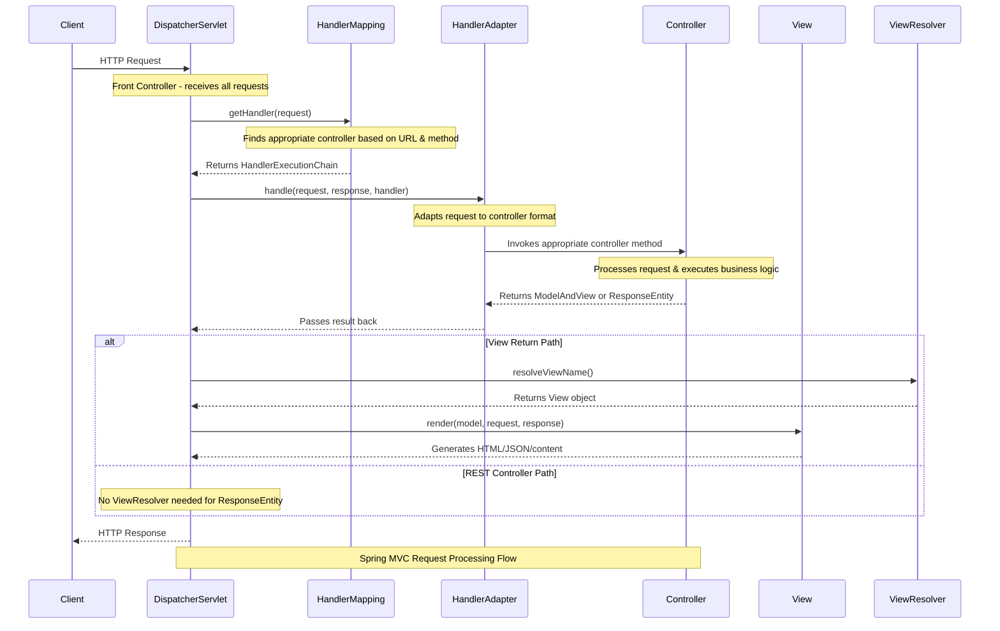

```mermaid

sequenceDiagram
    participant Client
    participant DS as DispatcherServlet
    participant HM as HandlerMapping
    participant HA as HandlerAdapter
    participant C as Controller
    participant V as View
    participant VR as ViewResolver

    Client->>DS: HTTP Request
    Note over DS: Front Controller - receives all requests

    DS->>HM: getHandler(request)
    Note over HM: Finds appropriate controller based on URL & method
    HM-->>DS: Returns HandlerExecutionChain

    DS->>HA: handle(request, response, handler)
    Note over HA: Adapts request to controller format

    HA->>C: Invokes appropriate controller method
    Note over C: Processes request & executes business logic
    C-->>HA: Returns ModelAndView or ResponseEntity

    HA-->>DS: Passes result back

    alt View Return Path
        DS->>VR: resolveViewName()
        VR-->>DS: Returns View object
        DS->>V: render(model, request, response)
        V-->>DS: Generates HTML/JSON/content
    else REST Controller Path
        Note over DS: No ViewResolver needed for ResponseEntity
    end

    DS-->>Client: HTTP Response

    Note over DS,C: Spring MVC Request Processing Flow
```