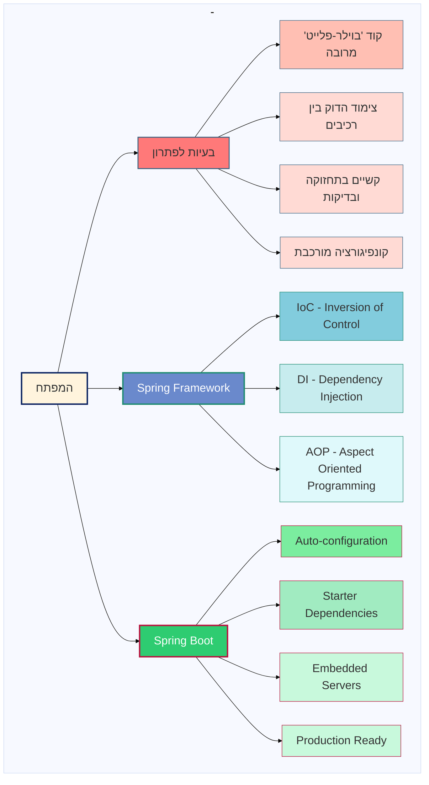

<div dir="rtl">

# Spring Framework ו-Spring Boot: פתרונות לאתגרי פיתוח

## הדיאגרמה: אקוסיסטם Spring



## מבוא

הדיאגרמה לעיל מציגה את האקוסיסטם של Spring ואיך המסגרות השונות מתמודדות עם אתגרי פיתוח נפוצים. המסמך הזה מסביר בפירוט כיצד Spring Framework ו-Spring Boot מספקים פתרונות לאתגרים אלו.

## אתגרי הפיתוח

מפתחי תוכנה נתקלים בארבעה אתגרים עיקריים בפיתוח אפליקציות מורכבות:

1. **קוד "בוילר-פלייט" מרובה**: קוד חוזר ושגרתי שצריך לכתוב שוב ושוב
2. **צימוד הדוק בין רכיבים**: תלויות הדוקות שמקשות על תחזוקה ושינויים
3. **קשיים בתחזוקה ובדיקות**: אתגרים בשמירה על קוד נקי וכתיבת בדיקות יעילות
4. **קונפיגורציה מורכבת**: צורך בהגדרות רבות ומסובכות

## Spring Framework - פתרונות לאתגרי פיתוח בסיסיים

Spring Framework מתמודד עם האתגרים הבסיסיים באמצעות שלושה עקרונות מרכזיים:

### 1. Inversion of Control (IoC) - היפוך השליטה
* **מה זה?** Spring מנהל את מחזור החיים של אובייקטים במקום שהמפתח יעשה זאת
* **איך זה עוזר?**
    * מפחית את הצורך בקוד ליצירה וניהול של אובייקטים
    * Spring Container יוצר, מנהל ומשמיד אובייקטים ("Beans") באופן אוטומטי

### 2. Dependency Injection (DI) - הזרקת תלויות
* **מה זה?** במקום שרכיב ייצור את התלויות שלו, Spring מזריק אותן מבחוץ
* **איך זה עוזר?**
    * מפחית את הצימוד בין רכיבים
    * מאפשר החלפה קלה של רכיבים למטרות בדיקה
    * הקוד נקי יותר, מודולרי יותר וקל לתחזוקה

</div>

```java
@Service
public class UserService {
    private final UserRepository userRepository;
    
    // Spring מזריק את ה-repository באופן אוטומטי
    public UserService(UserRepository userRepository) {
        this.userRepository = userRepository;
    }
}
```

<div dir="rtl">

### 3. Aspect Oriented Programming (AOP) - תכנות מונחה היבטים
* **מה זה?** מאפשר להפריד קוד חוצה-מערכת מהלוגיקה העסקית
* **איך זה עוזר?**
    * מטפל בנושאים כמו לוגים, אבטחה וטרנזקציות בצורה מרוכזת
    * מפחית כפילויות בקוד
    * מאפשר להתמקד בלוגיקה העסקית במקום בקוד תשתיתי

</div>

```java
@Aspect
@Component
public class LoggingAspect {
    @Before("execution(* com.example.service.*.*(..))")
    public void logBeforeMethodExecution(JoinPoint joinPoint) {
        // קוד הלוגים נכתב פעם אחת ומופעל במקומות רבים
        System.out.println("About to execute: " + joinPoint.getSignature());
    }
}
```

<div dir="rtl">

## Spring Boot - פתרונות לפישוט ואוטומציה

Spring Boot בנוי מעל Spring Framework ומוסיף שכבה של אוטומציה ופישוט:

### 1. Auto-configuration - קונפיגורציה אוטומטית
* **מה זה?** Spring Boot מגדיר אוטומטית קונפיגורציות ברירת מחדל המבוססות על הספריות שבשימוש
* **איך זה עוזר?**
    * מפחית דרמטית את כמות הקונפיגורציה הנדרשת
    * מספק הגדרות ברירת מחדל חכמות שעובדות ברוב המקרים
    * ניתן לדרוס ולהתאים הגדרות לפי הצורך
  
</div>

```
```properties
# במקום עשרות שורות של קונפיגורציה, מספיק:
spring.datasource.url=jdbc:mysql://localhost/db
spring.datasource.username=user
spring.datasource.password=pass
```


<div dir="rtl">

### 2. Starter Dependencies - חבילות תלויות מוכנות
* **מה זה?** חבילות מוגדרות מראש שמכילות את כל התלויות הנדרשות לתכונה מסוימת
* **איך זה עוזר?**
    * מפשט את ניהול התלויות
    * מבטיח תאימות בין גרסאות שונות
    * מפחית את הצורך בהגדרות ארוכות של dependencies


</div>

```xml
<!-- במקום להגדיר עשרות dependencies בנפרד, מספיק: -->
<dependency>
    <groupId>org.springframework.boot</groupId>
    <artifactId>spring-boot-starter-web</artifactId>
</dependency>
```


<div dir="rtl">

### 3. Embedded Servers - שרתים מובנים
* **מה זה?** Spring Boot מגיע עם שרתי אפליקציה מובנים (כמו Tomcat)
* **איך זה עוזר?**
    * מאפשר להריץ את האפליקציה כקובץ JAR פשוט
    * אין צורך בהתקנה ובקונפיגורציה נפרדת של שרת
    * מפשט פריסה והפצה

</div>

```

```bash
# הפעלה פשוטה של האפליקציה כקובץ JAR
java -jar myapp.jar
```

<div dir="rtl">

### 4. Production Ready - מוכנות לסביבת ייצור
* **מה זה?** תכונות מובנות שמיועדות לניטור, בקרה ותפעול של האפליקציה בסביבת ייצור
* **איך זה עוזר?**
    * מספק נקודות קצה לניטור בריאות האפליקציה
    * כולל מטריקות, לוגים ונתוני ביצועים
    * תמיכה מובנית בכלי ניטור ותפעול

</div>


```java
// ללא קוד נוסף, Spring Boot מספק נקודות קצה כמו:
// /actuator/health
// /actuator/metrics
// /actuator/info
```

<div dir="rtl">

## דוגמה מעשית: השוואת קוד

### לפני Spring:

</div>

```
// יצירה ידנית של אובייקטים וניהול תלויות
DatabaseConnection conn = new DatabaseConnection("jdbc:mysql://localhost/db", "user", "pass");
UserRepository userRepo = new UserRepository(conn);
AuthenticationService authService = new AuthenticationService();
UserService userService = new UserService(userRepo, authService);

// טיפול ידני בטרנזקציות
conn.startTransaction();
try {
    userService.createUser("john", "pass123");
    conn.commit();
} catch (Exception e) {
    conn.rollback();
    throw e;
}
```

<div dir="rtl">

### עם Spring Boot:


</div>

```java
@RestController
public class UserController {
    private final UserService userService;
    
    // Spring מזריק את השירות אוטומטית
    public UserController(UserService userService) {
        this.userService = userService;
    }
    
    // Spring Boot מטפל בניתוב HTTP
    @PostMapping("/users")
    // Spring מטפל אוטומטית בטרנזקציות
    @Transactional
    public ResponseEntity<User> createUser(@RequestBody UserDTO userDTO) {
        User user = userService.createUser(userDTO.getUsername(), userDTO.getPassword());
        return ResponseEntity.ok(user);
    }
}
```
<div dir="rtl">


Spring Framework ו-Spring Boot הפכו את פיתוח אפליקציות Enterprise ב-Java לפשוט יותר, נקי יותר ויעיל יותר:

1. **Spring Framework** מספק את הבסיס הארכיטקטוני (IoC, DI, AOP) שמפחית קוד בוילרפלייט, מפחית צימוד, ומקל על תחזוקה ובדיקות.

2. **Spring Boot** בונה מעל Spring Framework ומוסיף קונפיגורציה אוטומטית, חבילות מוכנות, שרתים מובנים ותכונות מוכנות לסביבת ייצור.

ביחד, הם מאפשרים למפתחים להתמקד בלוגיקה העסקית האמיתית של האפליקציה, במקום להתעסק בפרטים תשתיתיים וקוד חוזר.

</div>