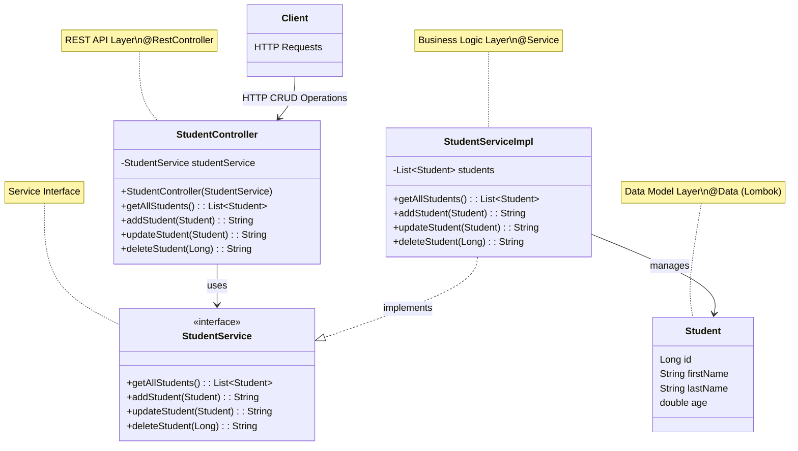
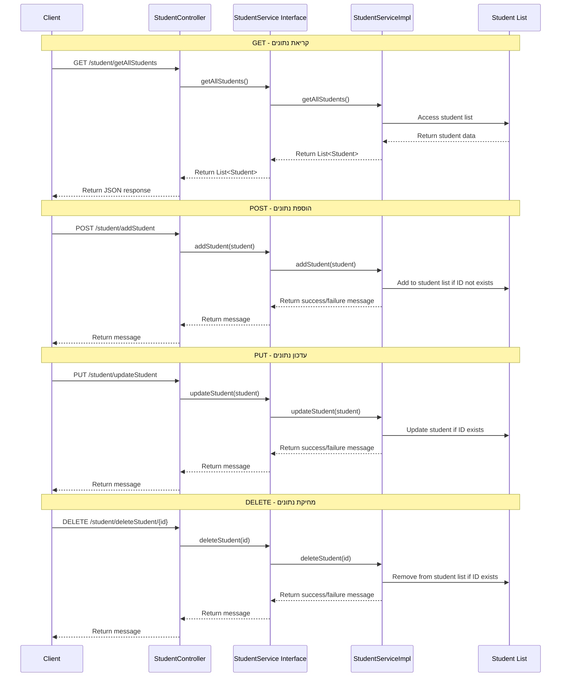

<div dir="rtl">

# מדריך מקיף לאפליקציית Spring Boot עם פעולות CRUD


## מבנה הפרויקט

אפליקציית Spring Boot זו מהווה מערכת מלאה לניהול סטודנטים, הכוללת את כל פעולות ה-CRUD (יצירה, קריאה, עדכון ומחיקה). המערכת מאורגנת בארכיטקטורת שכבות ברורה:

- **model**: מכיל את מחלקת `Student` עם שימוש ב-Lombok להפחתת קוד שגרתי
- **service**: מכיל את `StudentService` (ממשק) ו-`StudentServiceImpl` (מימוש) עם מימוש של כל פעולות ה-CRUD
- **controller**: מכיל את `StudentController` המטפל בבקשות HTTP ומעביר אותן לשירות המתאים

שלב זה בפרויקט מציג שימוש בטכנולוגיות מתקדמות יותר כמו:
- ספריית **Lombok** להפחתת קוד שגרתי
- **RESTful API** מלא עם כל סוגי הבקשות (GET, POST, PUT, DELETE)
- שימוש ב**אנוטציות מתקדמות** של Spring MVC
- **הפרדת ממשקים ממימושים** ליצירת ארכיטקטורה גמישה ובת-תחזוקה

</div>

## קוד האפליקציה

### StudentController.java
```java
package org.example.stage5.controller;

import org.example.stage5.model.Student;
import org.example.stage5.service.StudentServiceImpl;
import org.springframework.web.bind.annotation.*;

import java.util.List;

@RestController
@RequestMapping("/student")
public class StudentController {

    private final StudentService studentService;  // שימוש בממשק, לא במימוש הספציפי

    public StudentController(StudentService studentService) {
        this.studentService = studentService;
    }

    @GetMapping("/getAllStudents")
    public List<Student> getAllStudents() {
        return studentService.getAllStudents();
    }

    @PostMapping("/addStudent")
    public String addStudent(@RequestBody Student student) {
        return studentService.addStudent(student);
    }

    @PutMapping("/updateStudent")
    public String updateStudent(@RequestBody Student student) {
        return studentService.updateStudent(student);
    }

    @DeleteMapping("/deleteStudent/{id}")
    public String deleteStudent(@PathVariable Long id) {
        return studentService.deleteStudent(id);
    }
}
```

### Student.java
```java
package org.example.stage5.model;

import lombok.AllArgsConstructor;
import lombok.Data;
import lombok.NoArgsConstructor;
import lombok.ToString;

/*
   Lombok, boilerplate code reduction library, is used to generate the getters, setters, equals, hashcode, and toString methods.
 */
@Data
@NoArgsConstructor
@AllArgsConstructor
@ToString
public class Student {
    Long id;
    String firstName;
    String lastName;
    double age;
}
```

### StudentService.java
```java
package org.example.stage5.service;

import org.example.stage5.model.Student;
import java.util.List;

public interface StudentService {
    List<Student> getAllStudents();
    String addStudent(Student student);
    String updateStudent(Student student);
    String deleteStudent(Long id);
}
```

### StudentServiceImpl.java
```java
package org.example.stage5.service;

import org.example.stage5.model.Student;
import org.springframework.stereotype.Service;

import java.util.ArrayList;
import java.util.Arrays;
import java.util.List;

@Service
public class StudentServiceImpl implements StudentService {

    List<Student> students = new ArrayList<>(Arrays.asList(
        new Student(1L, "Alice", "Moskovitz", 21.3),
        new Student(2L, "Bob", "Smith", 22.3),
        new Student(3L, "Charlie", "Brown", 23.3),
        new Student(4L, "David", "Miller", 24.3)
    ));

    @Override
    public List<Student> getAllStudents() {
        return students;
    }

    @Override
    public String addStudent(Student student) {
        // check if a student already exists
        if (students.stream().anyMatch(s -> s.getId().equals(student.getId()))) {
            return ("Student with id " + student.getId() + " already exists");
        }
        students.add(student);
        return "Student added successfully";
    }

    @Override
    public String updateStudent(Student student) {
        // מימוש יעיל יותר של מתודת העדכון
        for (Student existingStudent : students) {
            if (existingStudent.getId().equals(student.getId())) {
                existingStudent.setFirstName(student.getFirstName());
                existingStudent.setLastName(student.getLastName());
                existingStudent.setAge(student.getAge());
                return "Student updated successfully";
            }
        }
        return "Student with id " + student.getId() + " does not exist";
    }

    @Override
    public String deleteStudent(Long id) {
        // check if a student exists
        if (students.stream().noneMatch(s -> s.getId().equals(id))) {
            return ("Student with id " + id + " does not exist");
        }
        students.removeIf(s -> s.getId().equals(id));
        return "Student deleted successfully";
    }
}
```

<div dir="rtl">

## ארכיטקטורת האפליקציה

</div>



<div dir="rtl">

## זרימת בקשות CRUD במערכת

</div>



<div dir="rtl">

## שינויים עיקריים והתקדמות מהגרסה הקודמת

### 1. התרחבות מ-GET בלבד ל-CRUD מלא
הגרסה החדשה מרחיבה את הפונקציונליות מבקשת GET פשוטה לכל פעולות ה-CRUD:

- **CREATE (POST)**: הוספת סטודנט חדש
- **READ (GET)**: קבלת רשימת כל הסטודנטים
- **UPDATE (PUT)**: עדכון פרטי סטודנט קיים
- **DELETE (DELETE)**: מחיקת סטודנט לפי מזהה

### 2. שימוש ב-Lombok

מחלקת `Student` עכשיו משתמשת ב-Lombok, ספרייה שמפחיתה את כמות הקוד השגרתי (boilerplate):

</div>

```
@Data               // מייצר getter/setter, equals, hashCode, toString
@NoArgsConstructor  // מייצר בנאי ריק
@AllArgsConstructor // מייצר בנאי עם כל הפרמטרים
@ToString           // מייצר מתודת toString (נכלל ב-@Data)
```

<div dir="rtl">

יתרונות השימוש ב-Lombok:
- **קוד נקי יותר**: הקטנת כמות הקוד השגרתי
- **תחזוקה פשוטה יותר**: פחות קוד לתחזק ולתקן
- **ריכוז תשומת הלב בלוגיקה העסקית**: במקום בקוד תשתיתי

### 3. הפרדה בין ממשק למימוש בשכבת השירות

שימוש ב-`StudentService` כממשק ו-`StudentServiceImpl` כמימוש מספק יתרונות רבים:

1. **עקרון ההפרדה (Dependency Inversion Principle)**:
   - הקוד תלוי בהפשטות (ממשקים) ולא במימושים קונקרטיים
   - שכבות גבוהות יותר לא תלויות בפרטי המימוש של שכבות נמוכות יותר

2. **גמישות ותחזוקה**:
   - מאפשר להחליף מימושים ללא שינוי בממשק
   - למשל, אפשר להחליף את מימוש השירות כך שישתמש בבסיס נתונים במקום ברשימה בזיכרון
   - הרחבות וחיבור למערכות אחרות מתאפשרים בקלות רבה יותר

3. **בדיקות יעילות יותר**:
   - יצירת Mock (חיקוי) לשירות עבור בדיקות יחידה של הבקר
   - בדיקות אינטגרציה יעילות יותר באמצעות החלפת מימושים לצורכי בדיקה

4. **הסכם ברור**:
   - הממשק מגדיר חוזה ברור בין השכבות
   - מאפשר פיתוח במקביל של מימושים שונים וחלקים שונים במערכת

### 4. ולידציה בסיסית בשירות

`StudentServiceImpl` מבצע ולידציה בסיסית לפני ביצוע פעולות:
- בדיקה שמזהה לא קיים לפני הוספה
- בדיקה שמזהה קיים לפני עדכון או מחיקה
- החזרת הודעות שגיאה מתאימות במקרה של בעיה

### 5. שימוש ב-Stream API

השירות עושה שימוש ב-Stream API של Java 8 לביצוע פעולות על רשימת הסטודנטים:

</div>

```
// בדיקה אם סטודנט קיים
students.stream().anyMatch(s -> s.getId().equals(student.getId()))

// מחיקה לפי מזהה
students.removeIf(s -> s.getId().equals(id));
```

<div dir="rtl">

כמו כן, מימוש מתודת updateStudent שופר לגרסה יעילה יותר, שמשתמשת בלולאה רגילה:

</div>

```
// מימוש יעיל למציאת ועדכון סטודנט
for (Student existingStudent : students) {
    if (existingStudent.getId().equals(student.getId())) {
        existingStudent.setFirstName(student.getFirstName());
        existingStudent.setLastName(student.getLastName());
        existingStudent.setAge(student.getAge());
        return "Student updated successfully";
    }
}
```

<div dir="rtl">

## בדיקת האפליקציה

כעת, עם מגוון רחב יותר של פעולות, ניתן לבדוק את האפליקציה באמצעות:

### 1. בדיקה באמצעות HTTP Client של IntelliJ

</div>

```http
### קבלת כל הסטודנטים
GET http://localhost:8080/student/getAllStudents
Accept: application/json

### הוספת סטודנט חדש
POST http://localhost:8080/student/addStudent
Content-Type: application/json

{
  "id": 5,
  "firstName": "Eva",
  "lastName": "Cohen",
  "age": 20.5
}

### עדכון סטודנט קיים
PUT http://localhost:8080/student/updateStudent
Content-Type: application/json

{
  "id": 3,
  "firstName": "Charles",
  "lastName": "Brown",
  "age": 23.5
}

### מחיקת סטודנט
DELETE http://localhost:8080/student/deleteStudent/2
```

<div dir="rtl">

### 2. בדיקה באמצעות Postman

יש ליצור אוסף בקשות המכסה את כל הפעולות:

1. GET - `http://localhost:8080/student/getAllStudents`
2. POST - `http://localhost:8080/student/addStudent` (עם גוף בקשה JSON)
3. PUT - `http://localhost:8080/student/updateStudent` (עם גוף בקשה JSON)
4. DELETE - `http://localhost:8080/student/deleteStudent/{id}`

## יתרונות ארכיטקטורה מבוססת שכבות ו-REST

### ארכיטקטורת שכבות
1. **הפרדת אחריות**: כל שכבה אחראית על פונקציונליות ספציפית
   - בקר: טיפול בבקשות HTTP
   - שירות: לוגיקה עסקית (באמצעות ממשק וממימוש)
   - מודל: ייצוג הנתונים

2. **תחזוקה**: קל יותר לשנות או להחליף רכיב בודד

3. **בדיקה**: אפשר לבדוק כל שכבה בנפרד

### RESTful API
1. **סטנדרטיזציה**: שימוש בפעולות HTTP סטנדרטיות (GET, POST, PUT, DELETE)

2. **קלות שימוש**: ניתוב פשוט המבוסס על משאבים ופעולות

3. **סקלביליות**: תמיכה בריבוי לקוחות (אתרים, אפליקציות מובייל, שירותים אחרים)

## אבטחה ושיפורים אפשריים

1. **דירוג תשובות HTTP**: להחזיר קודי סטטוס מתאימים (200, 201, 404, 400 וכו')

2. **ולידציה**: להוסיף ולידציה מתקדמת על קלט המשתמש

3. **אבטחה**: להוסיף אימות והרשאות

4. **בסיס נתונים**: להחליף את הרשימה בזיכרון בבסיס נתונים אמיתי (יתרון של הפרדת הממשק מהמימוש!)


</div>