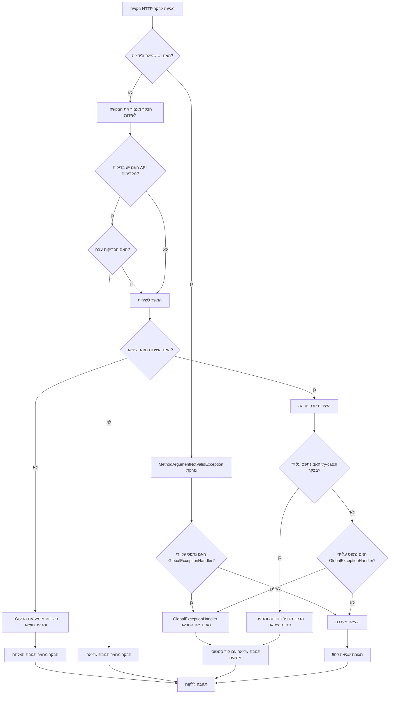

<div dir="rtl">

# תהליך הטיפול בחריגות ב-Spring Boot


## סקירת המערכת

בקוד , מיושמת מערכת טיפול בחריגות מקיפה המשלבת מספר רכיבים:

1. **חריגות מותאמות אישית** (`NotFoundException.java`)
2. **מודל תגובת שגיאה מובנה** (`ErrorResponse.java`)
3. **טיפול בחריגות ברמת הבקר** (ב-`StudentController.java`)
4. **טיפול גלובלי בחריגות** (ב-`GlobalExceptionHandler.java`)
5. **זריקת חריגות בשכבת השירות** (ב-`StudentService.java`)

 נסקור כיצד כל הרכיבים האלה עובדים יחד.

## רכיבי המערכת בפירוט

### 1. חריגה מותאמת אישית - NotFoundException

</div>

```java
package org.example.stage6.exception;

// custom exception class for 404 Not Found
public class NotFoundException extends RuntimeException {
    public NotFoundException(String message) {
        super(message);
    }
}
```

<div dir="rtl">

מחלקה זו מייצגת חריגה ספציפית למקרה שמשאב (סטודנט) לא נמצא. היא מרחיבה את `RuntimeException`, כך שאין צורך לתפוס אותה במפורש בקוד הקורא.

### 2. מודל תגובת שגיאה - ErrorResponse

</div>

```java
package org.example.stage6.model;

import lombok.Data;
import java.time.LocalDateTime;

@Data
public class ErrorResponse {
    private String error;
    private String message;
    private LocalDateTime timestamp;

    public ErrorResponse(String error, String message) {
        this.error = error;
        this.message = message;
        this.timestamp = LocalDateTime.now();
    }
}
```

<div dir="rtl">

מחלקה זו מגדירה את המבנה האחיד של תגובות שגיאה. היא כוללת:
- `error` - כותרת השגיאה או סוגה
- `message` - תיאור מפורט של השגיאה
- `timestamp` - זמן התרחשות השגיאה

### 3. שכבת השירות - מקום זריקת החריגות

במחלקת `StudentService`, החריגות נזרקות במקומות מתאימים כאשר חוקים עסקיים מופרים:

</div>

```java
// בדיקה אם סטודנט עם המזהה הנתון קיים
if (students.stream().noneMatch(s -> s.getId().equals(student.getId()))) {
    throw new NotFoundException("Student with id " + student.getId() + " does not exist");
}

// בדיקות ולידציה נוספות בשיטה הפרטית validateStudent
private void validateStudent(Student student) {
    // בדיקה אם שם פרטי ושם משפחה זהים
    if (student.getFirstName() != null && student.getLastName() != null) {
        if (student.getFirstName().equals(student.getLastName())) {
            throw new IllegalArgumentException("First name and last name cannot be identical");
        }
    }
    
    // בדיקת ייחודיות שם
    boolean duplicateNameExists = students.stream()
            .filter(s -> !s.getId().equals(student.getId()))
            .anyMatch(s -> s.getFirstName().equals(student.getFirstName()) &&
                    s.getLastName().equals(student.getLastName()));
    
    if (duplicateNameExists) {
        throw new IllegalArgumentException("A student with the same first and last name already exists");
    }
}
```

<div dir="rtl">

### 4. טיפול בחריגות ברמת הבקר

בקר הסטודנטים מטפל ישירות בחריגות בחלק מהמתודות:

</div>

```java
@PutMapping("/updateStudent/{id}")
public ResponseEntity<Object> updateStudent(@PathVariable Long id, @Valid @RequestBody Student student) {
    try {
        // בדיקה אם המזהה בגוף הבקשה תואם את המזהה בנתיב
        if (student.getId() != null && !student.getId().equals(id)) {
            return ResponseEntity
                    .badRequest()
                    .body(new ErrorResponse("ID mismatch",
                            "ID in the path (" + id + ") doesn't match ID in the request body (" + student.getId() + ")"));
        }

        student.setId(id);
        Student updated = studentService.updateStudent(student);
        return ResponseEntity.ok(updated);
    } catch (NotFoundException e) {
        return ResponseEntity
                .status(HttpStatus.NOT_FOUND)
                .body(new ErrorResponse("Student not found", e.getMessage()));
    } catch (IllegalArgumentException e) {
        return ResponseEntity
                .badRequest()
                .body(new ErrorResponse("Invalid data", e.getMessage()));
    }
}
```

<div dir="rtl">

כאן הבקר:
1. בודק תנאים שקשורים לממשק ה-API (כמו התאמת מזהה בנתיב ובגוף)
2. תופס חריגות שנזרקו משכבת השירות
3. ממיר אותן לתגובות HTTP מתאימות עם קודי סטטוס מתאימים

### 5. טיפול גלובלי בחריגות

המחלקה `GlobalExceptionHandler` מספקת טיפול ריכוזי בחריגות:

</div>

```java
@ControllerAdvice
public class GlobalExceptionHandler {

    @ExceptionHandler(MethodArgumentNotValidException.class)
    public ResponseEntity<ErrorResponse> handleValidationExceptions(MethodArgumentNotValidException ex) {
        Map<String, String> errors = new HashMap<>();
        ex.getBindingResult().getFieldErrors().forEach(error ->
                errors.put(error.getField(), error.getDefaultMessage())
        );

        ErrorResponse errorResponse = new ErrorResponse(
                "Validation failed",
                errors.toString()
        );

        return ResponseEntity.badRequest().body(errorResponse);
    }

    @ExceptionHandler(NotFoundException.class)
    public ResponseEntity<ErrorResponse> handleNotFoundException(NotFoundException ex) {
        ErrorResponse errorResponse = new ErrorResponse(
                "Resource not found",
                ex.getMessage()
        );

        return ResponseEntity.status(HttpStatus.NOT_FOUND).body(errorResponse);
    }

    // טיפול בסוגי חריגות נוספים...
}
```

<div dir="rtl">

מטפל זה:
1. מסומן ב-`@ControllerAdvice`, כך שהוא חל על כל הבקרים באפליקציה
2. מכיל מתודות המסומנות ב-`@ExceptionHandler` לטיפול בסוגי חריגות שונים
3. מחזיר `ResponseEntity` עם קוד סטטוס HTTP מתאים ואובייקט `ErrorResponse`

## זרימת הטיפול בשגיאות - המבנה הכולל


## שילוב גישות לטיפול בחריגות

<div dir="rtl">

בקוד יש שילוב מעניין בין שתי גישות לטיפול בחריגות. הסבר כל אחת מהגישות בפירוט:

### 1. טיפול לוקלי בחריגות (try-catch בבקר)

במתודות מסוימות בבקר, כמו `updateStudent` ו-`addStudent`, יש טיפול מקומי בחריגות:

</div>

<div dir="ltr">

```java
@PutMapping("/updateStudent/{id}")
public ResponseEntity<Object> updateStudent(@PathVariable Long id, @Valid @RequestBody Student student) {
    try {
        // בדיקת התאמת ID...
        student.setId(id);
        Student updated = studentService.updateStudent(student);
        return ResponseEntity.ok(updated);
    } catch (NotFoundException e) {
        return ResponseEntity
                .status(HttpStatus.NOT_FOUND)
                .body(new ErrorResponse("Student not found", e.getMessage()));
    } catch (IllegalArgumentException e) {
        return ResponseEntity
                .badRequest()
                .body(new ErrorResponse("Invalid data", e.getMessage()));
    }
}
```

</div>

<div dir="rtl">

**מאפיינים של טיפול לוקלי:**
* מאפשר שליטה מדויקת בקוד התגובה ובתוכן התגובה
* מאפשר לוגיקה ספציפית לטיפול בשגיאות בהקשר של מתודה מסוימת
* מוגבל למתודה שבה נמצא ה-try-catch

### 2. טיפול גלובלי בחריגות (GlobalExceptionHandler)

במקביל, קיים גם מטפל חריגות גלובלי:

</div>

<div dir="ltr">

```java
@ControllerAdvice
public class GlobalExceptionHandler {
    @ExceptionHandler(MethodArgumentNotValidException.class)
    public ResponseEntity<ErrorResponse> handleValidationExceptions(MethodArgumentNotValidException ex) {
        // טיפול בשגיאות ולידציה...
    }
   
    @ExceptionHandler(NotFoundException.class)
    public ResponseEntity<ErrorResponse> handleNotFoundException(NotFoundException ex) {
        // טיפול בשגיאות 'לא נמצא'...
    }
   
    // מטפלים נוספים...
}
```

</div>

<div dir="rtl">

**מאפיינים של טיפול גלובלי:**
* חל על כל האפליקציה
* מספק אחידות בטיפול בשגיאות
* מפשט את קוד הבקר
* מטפל בחריגות מערכת (כמו חריגות ולידציה) באופן מרכזי

### איך הן עובדות יחד?

בקוד, שתי השיטות משלימות זו את זו:

1. **סדר העדיפויות:**
    * אם יש try-catch בבקר, הוא ינסה לתפוס את החריגה תחילה
    * אם החריגה לא נתפסה בבקר או נזרקה מחוץ לבלוק ה-`try`, מטפל החריגות הגלובלי יתפוס אותה

2. **סיטואציות שונות:**
    * המטפל הגלובלי תופס שגיאות ולידציה `MethodArgumentNotValidException` שנזרקות כשהאנוטציה `@Valid` מפעילה ולידציה על אובייקט
    * הטיפול הלוקלי תופס חריגות שנזרקות משכבת השירות

3. **שגיאות עסקיות מול שגיאות מערכת:**
    * הטיפול הלוקלי מתמקד בשגיאות עסקיות ספציפיות (`NotFoundException`, `IllegalArgumentException`)
    * המטפל הגלובלי מספק רשת ביטחון לכל סוגי החריגות, כולל שגיאות מערכת לא צפויות

### דוגמה ספציפית לשילוב

בקוד, מתודת `getStudentById` אינה משתמשת ב-`try-catch`, אלא משתמשת ב-`Optional`:

</div>


<div dir="ltr">

```java
@GetMapping("/{id}")
public ResponseEntity<Object> getStudentById(@Valid @PathVariable Long id) {
    Optional<Student> studentOpt = studentService.getStudentById(id);
    return studentOpt.<ResponseEntity<Object>>map(student -> ResponseEntity.ok().body(student))
            .orElseGet(() -> ResponseEntity
                    .status(HttpStatus.NOT_FOUND)
                    .body(new ErrorResponse("Not Found", "Student with id " + id + " does not exist")));
}
```

</div>

<div dir="rtl">

אבל אם יש שגיאה בולידציה של הפרמטר `id` (למשל, אם המספר שהועבר אינו תקין), תיזרק חריגת `MethodArgumentNotValidException` שתיתפס על ידי המטפל הגלובלי.

זה מדגים את השילוב המושלם - הבקר מטפל בזרימה הלוגית הצפויה (סטודנט נמצא/לא נמצא), בעוד המטפל הגלובלי מטפל בשגיאות לא צפויות או שגיאות מערכת.

למעשה, אפשר לומר שהמערכת מספקת שני "קווי הגנה" לטיפול בשגיאות, מה שמבטיח חוויה עקבית למשתמש גם במקרה של שגיאות לא צפויות.

</div>


</div>



<div dir="rtl">

## שילוב בין טיפול לוקלי וגלובלי בחריגות

בקוד שהוצג, יש שילוב מעניין בין שתי גישות:

1. **טיפול לוקלי בחריגות (try-catch בבקר)** - במתודות כמו `updateStudent` ו-`addStudent`, הבקר תופס ומטפל בחריגות ספציפיות.

2. **טיפול גלובלי (GlobalExceptionHandler)** - נותן "רשת ביטחון" לחריגות שלא טופלו מקומית, וגם מטפל בחריגות כמו `MethodArgumentNotValidException` שנזרקות על ידי המסגרת.

### יתרונות הגישה המשולבת

1. **שליטה מדויקת** - הטיפול הלוקלי מאפשר לבקר לטפל בשגיאות בצורה מותאמת ספציפית להקשר של המתודה

2. **רשת ביטחון** - הטיפול הגלובלי מבטיח שכל החריגות יטופלו, גם אלה שלא נצפו או לא טופלו מקומית

3. **טיפול אחיד בחריגות framework** - חריגות המסגרת כמו `MethodArgumentNotValidException` מטופלות בצורה אחידה

## דוגמאות מעשיות

### 1. ולידציה מובנית וטיפול גלובלי

כאשר האנוטציה `@Valid` מפעילה ולידציה על אובייקט `Student`, כל שגיאת ולידציה גורמת לזריקת `MethodArgumentNotValidException`. חריגה זו נתפסת על ידי ה-`GlobalExceptionHandler` שמחזיר תגובת 400 Bad Request עם פירוט השגיאות.

### 2. טיפול לוקלי בחריגות השירות

במתודת `updateStudent`, הבקר תופס באופן ספציפי:
- `NotFoundException` - כאשר הסטודנט לא נמצא, מחזיר 404 Not Found
- `IllegalArgumentException` - כאשר יש בעיה בנתונים, מחזיר 400 Bad Request

### 3. בדיקות תקינות API ספציפיות

במתודת `updateStudent`, הבקר בודק התאמה בין המזהה בנתיב למזהה בגוף הבקשה:

```java
if (student.getId() != null && !student.getId().equals(id)) {
    return ResponseEntity
            .badRequest()
            .body(new ErrorResponse("ID mismatch", "ID in the path (" + id + 
                    ") doesn't match ID in the request body (" + student.getId() + ")"));
}
```

זוהי בדיקה ייחודית לממשק ה-API, ולכן מתבצעת ישירות בבקר ולא בשירות.

## סיכום ומסקנות

המערכת שהוצגה משלבת בצורה אלגנטית וקוהרנטית בין:

1. **חריגות מותאמות אישית** - לייצוג שגיאות ספציפיות לתחום

2. **שכבת שירות שמבצעת בדיקות לוגיקה עסקית** - וזורקת חריגות מתאימות

3. **בקר שמבצע בדיקות ברמת ה-API** - ומטפל בחריגות ספציפיות

4. **מטפל חריגות גלובלי** - שמספק רשת ביטחון ואחידות בטיפול בשגיאות

5. **אובייקט תגובת שגיאה אחיד** - שמספק למשתמשים מבנה עקבי ואינפורמטיבי

שילוב זה מאפשר לבנות API איכותי, עמיד לשגיאות, ונוח לשימוש, תוך שמירה על קוד נקי, מודולרי ומופרד היטב.

</div>