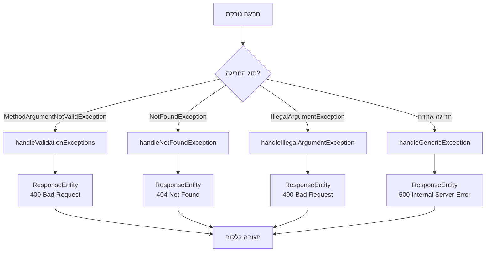

<div dir="rtl">

# מנגנון טיפול בחריגות ב-Spring Boot


## מבוא

טיפול בשגיאות הוא חלק קריטי מכל אפליקציה מקצועית. ב-Spring Boot, קיים מנגנון מתקדם לטיפול בחריגות (Exceptions) שמאפשר לייצר תגובות שגיאה עקביות ומובנות.

המנגנון שהוטמע בפרויקט שלנו כולל:
1. חריגות מותאמות אישית (Custom Exceptions)
2. מטפל חריגות גלובלי (Global Exception Handler)
3. מחלקה אחידה לתגובות שגיאה (Error Response)

## הזרימה של טיפול בשגיאות

```mermaid
sequenceDiagram
    participant Client
    participant Controller
    participant Service
    participant ExHandler as Global Exception Handler
    
    Client->>Controller: בקשת HTTP
    
    rect rgb(0, 0, 0)
    note right of Controller: מקרה 1: שגיאת ולידציה
    Controller->>Controller: בדיקת ולידציה של הקלט (@Valid)
    Controller--xExHandler: MethodArgumentNotValidException
    ExHandler-->>Client: תגובת שגיאה 400 Bad Request
    end
    
    rect rgb(20, 20, 20)
    note right of Controller: מקרה 2: משאב לא נמצא
    Controller->>Service: קריאה לשירות
    Service--xController: זריקת NotFoundException
    Controller--xExHandler: העברת NotFoundException
    ExHandler-->>Client: תגובת שגיאה 404 Not Found
    end
    
    rect rgb(0, 0, 0)
    note right of Controller: מקרה 3: קלט לא תקין
    Controller->>Service: קריאה לשירות
    Service--xController: זריקת IllegalArgumentException
    Controller--xExHandler: העברת IllegalArgumentException
    ExHandler-->>Client: תגובת שגיאה 400 Bad Request
    end
    
    rect rgb(20, 20, 20)
    note right of Controller: מקרה 4: שגיאה כללית
    Controller->>Service: קריאה לשירות
    Service--xController: זריקת Exception אחרת
    Controller--xExHandler: העברת Exception
    ExHandler-->>Client: תגובת שגיאה 500 Internal Server Error
    end
```

</div>



<div dir="rtl">

## רכיבי מערכת הטיפול בחריגות

### 1. חריגות מותאמות אישית

יצרנו מחלקת חריגה מותאמת אישית `NotFoundException` שמשמשת למקרים שבהם משאב מבוקש (כמו סטודנט) לא נמצא:

</div>

```java
package org.example.stage6.exception;

public class NotFoundException extends RuntimeException {
    public NotFoundException(String message) {
        super(message);
    }
}
```

<div dir="rtl">

**יתרונות של חריגות מותאמות אישית**:
- מאפשרות טיפול ספציפי לכל סוג שגיאה
- מגבירות את קריאות הקוד (ברור מה השגיאה)
- מקלות על יצירת תגובות HTTP מתאימות

### 2. מחלקת תגובת שגיאה

מחלקה זו מספקת מבנה אחיד לכל תגובות השגיאה:

</div>

```java
package org.example.stage6.model;

import lombok.Data;
import java.time.LocalDateTime;

@Data
public class ErrorResponse {
    private String error;
    private String message;
    private LocalDateTime timestamp;

    public ErrorResponse(String error, String message) {
        this.error = error;
        this.message = message;
        this.timestamp = LocalDateTime.now();
    }
}
```

<div dir="rtl">

**יתרונות של מבנה תגובה אחיד**:
- קל לצרכני ה-API להתמודד עם שגיאות
- כולל מידע שימושי (סוג השגיאה, הודעה, זמן התרחשות)
- שומר על עקביות בממשק המשתמש

### 3. מטפל חריגות גלובלי

זהו הרכיב המרכזי שאחראי על תפיסת החריגות והמרתן לתגובות HTTP. הוא מופעל אוטומטית על ידי Spring כאשר נזרקת חריגה:

</div>

```java
package org.example.stage6.exception;

import org.example.stage6.model.ErrorResponse;
import org.springframework.http.HttpStatus;
import org.springframework.http.ResponseEntity;
import org.springframework.web.bind.MethodArgumentNotValidException;
import org.springframework.web.bind.annotation.ControllerAdvice;
import org.springframework.web.bind.annotation.ExceptionHandler;

import java.util.HashMap;
import java.util.Map;

@ControllerAdvice
public class GlobalExceptionHandler {

    @ExceptionHandler(MethodArgumentNotValidException.class)
    public ResponseEntity<ErrorResponse> handleValidationExceptions(MethodArgumentNotValidException ex) {
        Map<String, String> errors = new HashMap<>();
        ex.getBindingResult().getFieldErrors().forEach(error -> 
            errors.put(error.getField(), error.getDefaultMessage())
        );
        
        ErrorResponse errorResponse = new ErrorResponse(
            "Validation failed",
            errors.toString()
        );
        
        return ResponseEntity.badRequest().body(errorResponse);
    }
    
    @ExceptionHandler(NotFoundException.class)
    public ResponseEntity<ErrorResponse> handleNotFoundException(NotFoundException ex) {
        ErrorResponse errorResponse = new ErrorResponse(
            "Resource not found",
            ex.getMessage()
        );
        
        return ResponseEntity.status(HttpStatus.NOT_FOUND).body(errorResponse);
    }
    
    @ExceptionHandler(IllegalArgumentException.class)
    public ResponseEntity<ErrorResponse> handleIllegalArgumentException(IllegalArgumentException ex) {
        ErrorResponse errorResponse = new ErrorResponse(
            "Invalid input",
            ex.getMessage()
        );
        
        return ResponseEntity.badRequest().body(errorResponse);
    }
    
    @ExceptionHandler(Exception.class)
    public ResponseEntity<ErrorResponse> handleGenericException(Exception ex) {
        ErrorResponse errorResponse = new ErrorResponse(
            "Internal server error",
            ex.getMessage()
        );
        
        return ResponseEntity.status(HttpStatus.INTERNAL_SERVER_ERROR).body(errorResponse);
    }
}
```

<div dir="rtl">

## איך זה עובד? הסבר מפורט

### 1. הפעלת המנגנון - אנוטציית `@ControllerAdvice`

האנוטציה `@ControllerAdvice` מסמנת את המחלקה כמטפל גלובלי בחריגות. Spring יפעיל את המחלקה הזו כל פעם שתיזרק חריגה בתהליך הטיפול בבקשת HTTP בכל הבקרים באפליקציה.

### 2. הגדרת מטפלי חריגה ספציפיים - אנוטציית `@ExceptionHandler`

כל מתודה במחלקת ה-`GlobalExceptionHandler` שמסומנת באנוטציה `@ExceptionHandler` מגדירה איזה סוג חריגה היא מטפלת בו. למשל:

- `@ExceptionHandler(NotFoundException.class)` - מטפלת בחריגות מסוג `NotFoundException`
- `@ExceptionHandler(Exception.class)` - רשת ביטחון שתופסת כל חריגה אחרת

### 3. סדר מטפלי החריגה

Spring ינסה למצוא את המטפל הספציפי ביותר לחריגה שנזרקה. למשל:
- אם נזרקה `NotFoundException`, המתודה `handleNotFoundException` תטפל בה
- אם נזרקה חריגה שאין לה מטפל ספציפי, המתודה `handleGenericException` תטפל בה כמוצא אחרון

זה מתואר בתרשים הזרימה הבא:

</div>



<div dir="rtl">

### 4. יצירת תגובות HTTP מתאימות

כל מתודת טיפול מייצרת אובייקט `ResponseEntity` שכולל:
- קוד סטטוס HTTP מתאים (400, 404, 500 וכו')
- אובייקט `ErrorResponse` שמכיל את פרטי השגיאה

### 5. דוגמאות לזריקת חריגות בשירות

השירות יכול לזרוק חריגות במקרים שונים:

</div>

```java
// במקרה שסטודנט לא נמצא
public Student updateStudent(Student student) {
    if (students.stream().noneMatch(s -> s.getId().equals(student.getId()))) {
        throw new NotFoundException("Student with id " + student.getId() + " does not exist");
    }
    // המשך הקוד...
}

// במקרה של קלט לא תקין
private void validateStudent(Student student) {
    if (student.getFirstName() != null && student.getLastName() != null) {
        if (student.getFirstName().equals(student.getLastName())) {
            throw new IllegalArgumentException("First name and last name cannot be identical");
        }
    }
    // המשך הקוד...
}
```

<div dir="rtl">

## דוגמאות לתגובות שגיאה

### 1. שגיאת ולידציה (400 Bad Request)

</div>

```json
{
  "error": "Validation failed",
  "message": "{firstName=First name must be between 2 and 50 characters, age=Age should not be less than 16}",
  "timestamp": "2025-03-16T14:32:45.123"
}
```

<div dir="rtl">

### 2. משאב לא נמצא (404 Not Found)

</div>

```json
{
  "error": "Resource not found",
  "message": "Student with id 100 does not exist",
  "timestamp": "2025-03-16T14:33:12.456"
}
```

<div dir="rtl">

### 3. שגיאה פנימית (500 Internal Server Error)

</div>

```json
{
  "error": "Internal server error",
  "message": "An unexpected error occurred while processing your request",
  "timestamp": "2025-03-16T14:34:01.789"
}
```

<div dir="rtl">

## שגיאות ולידציה מיוחדות

שגיאות ולידציה מטופלות בצורה מיוחדת. כאשר נעשה שימוש באנוטציה `@Valid` לפני פרמטר בבקר, Spring יבצע ולידציה אוטומטית לפי האנוטציות שהוגדרו במודל:

</div>

```java
@PostMapping("/addStudent")
public ResponseEntity<Object> addStudent(@Valid @RequestBody Student student) {
    // הקוד יגיע לכאן רק אם הולידציה עברה בהצלחה
    // ...
}
```

<div dir="rtl">

אם הולידציה נכשלת, תיזרק חריגה מסוג `MethodArgumentNotValidException` שתיתפס על ידי המטפל הגלובלי.

## יתרונות המערכת

1. **הפרדת אחריות** - הקוד העסקי של הבקרים והשירותים נשאר נקי מלוגיקת טיפול בשגיאות
2. **עקביות** - כל השגיאות מטופלות בצורה אחידה ומחזירות תגובות במבנה זהה
3. **תחזוקתיות** - קל להוסיף או לשנות את הטיפול בסוגי שגיאות חדשים
4. **אבטחה** - ניתן לסנן מידע רגיש משגיאות לפני שליחתן ללקוח
5. **חווית משתמש טובה יותר** - הלקוח מקבל הודעות שגיאה ברורות וקודי סטטוס מתאימים

## סיכום

מערכת הטיפול בחריגות ב-Spring Boot מספקת דרך אלגנטית ויעילה לטפל בשגיאות באפליקציית REST API:

1. החריגות נזרקות במקום המתאים (בקר או שירות)
2. מטפל החריגות הגלובלי תופס את החריגות ומתרגם אותן לתגובות HTTP מתאימות
3. המשתמש מקבל הודעות שגיאה עקביות וקודי סטטוס מתאימים

ארכיטקטורה זו מאפשרת פיתוח קוד נקי ותחזוקתי, תוך שמירה על חווית משתמש מקצועית גם במקרים של שגיאות.

</div>