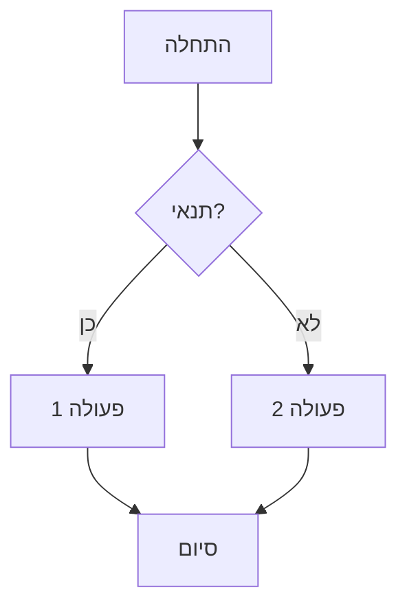
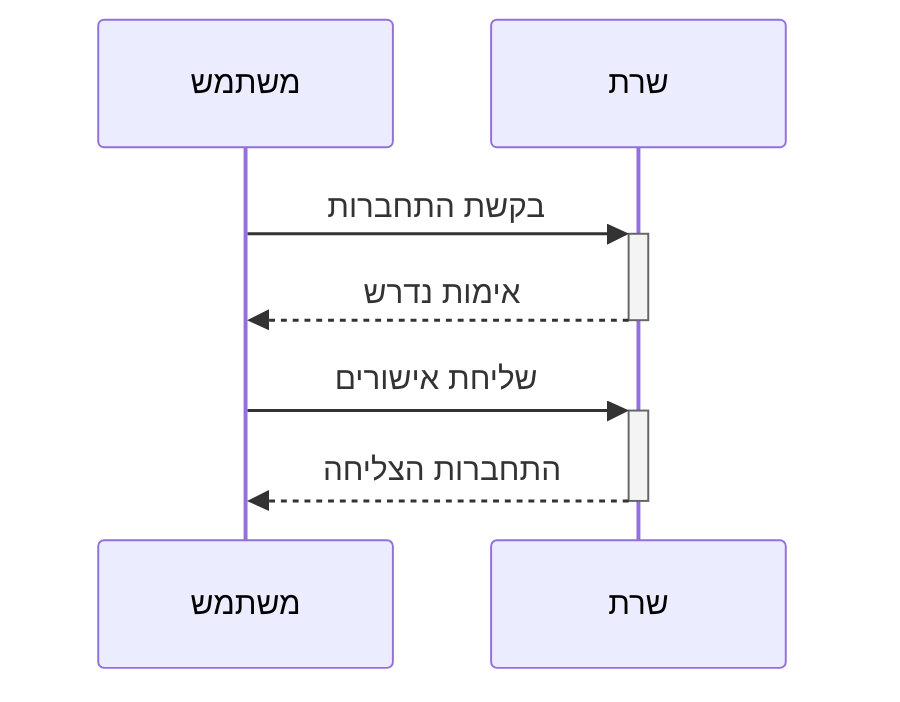
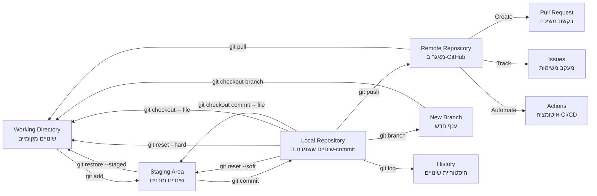

<div dir="rtl">

# מדריך כלים בסיסיים לקורס Java מתקדם

## תוכן עניינים

1. [מבוא](#מבוא)
2. [IntelliJ IDEA - סביבת הפיתוח](#intellij-idea---סביבת-הפיתוח)
    - [קיצורי מקשים חיוניים](#קיצורי-מקשים-חיוניים)
    - [התאמות מומלצות](#התאמות-מומלצות)
    - [עבודה עם GitHub Copilot](#עבודה-עם-github-copilot)
3. [Git - מערכת בקרת גרסאות](#git---מערכת-בקרת-גרסאות)
    - [התקנה והגדרה ראשונית](#התקנה-והגדרה-ראשונית)
    - [מושגי יסוד](#מושגי-יסוד)
    - [מחזור העבודה הבסיסי](#מחזור-העבודה-הבסיסי)
    - [עבודה עם ענפים](#עבודה-עם-ענפים)
    - [ביטול שינויים והחזרת גרסאות קודמות](#ביטול-שינויים-והחזרת-גרסאות-קודמות)
4. [GitHub - שיתוף ועבודת צוות](#github---שיתוף-ועבודת-צוות)
    - [יצירת חשבון ומאגרים](#יצירת-חשבון-ומאגרים)
    - [עבודה מול שרת מרוחק](#עבודה-מול-שרת-מרוחק)
    - [Pull Requests וסקירות קוד](#pull-requests-וסקירות-קוד)
    - [שימוש ב-Issues לניהול משימות](#שימוש-ב-issues-לניהול-משימות)
5. [CI/CD והאוטומציה בפיתוח](#cicd-והאוטומציה-בפיתוח)
    - [GitHub Actions בסיסי](#github-actions-בסיסי)
6. [תיעוד טכני עם Markdown](#תיעוד-טכני-עם-markdown)
    - [תחביר בסיסי](#תחביר-בסיסי)
    - [תרשימים עם Mermaid](#תרשימים-עם-mermaid)
7. [תרשימי זרימת עבודה](#תרשימי-זרימת-עבודה)
    - [תהליך העבודה המלא עם Git ו-GitHub](#תהליך-העבודה-המלא-עם-git-ו-github)
8. [פתרון בעיות נפוצות](#פתרון-בעיות-נפוצות)
9. [סיכום והמשך הקורס](#סיכום-והמשך-הקורס)

## מבוא

מדריך זה נועד להציג את הכלים הבסיסיים שישמשו אותנו לאורך הקורס ב-Java מתקדם. כלים אלו מהווים את התשתית לפיתוח מקצועי ומודרני, ומאפשרים עבודה יעילה, שיתופית ואיכותית. בהמשך הקורס נכיר כלים נוספים כמו בסיסי נתונים, Postman, Docker Desktop, ועוד, אך חשוב להתחיל בבסיס איתן.

השליטה בכלים אלו היא כיום מיומנות בסיסית הנדרשת מכל מפתח תוכנה מקצועי. הם מהווים את הבסיס של תרבות ה-DevOps ומתודולוגיות פיתוח אג'יליות, ומשפרים באופן משמעותי את איכות וקצב הפיתוח.

## IntelliJ IDEA - סביבת הפיתוח

IntelliJ IDEA היא סביבת פיתוח משולבת (IDE) מתקדמת מבית JetBrains המיועדת בעיקר לפיתוח Java, אך תומכת במגוון רחב של שפות ומסגרות עבודה.

### קיצורי מקשים חיוניים

להלן קיצורי המקשים החשובים ביותר שיחסכו לכם זמן רב:

#### עריכה בסיסית
- `Ctrl+Space` - השלמה בסיסית
- `Ctrl+Shift+Space` - השלמה חכמה
- `Ctrl+P` - מידע על פרמטרים של פונקציה
- `Ctrl+Q` - תצוגת דוקומנטציה מהירה
- `Alt+Insert` - יצירת קוד (מחלקות, שיטות, משתנים)
- `Ctrl+O` - דריסת שיטות
- `Ctrl+I` - מימוש שיטות ממשק
- `Ctrl+/` - הערת שורה
- `Ctrl+Shift+/` - הערת בלוק
- `Ctrl+D` - שכפול שורה נוכחית

#### ניווט
- `Ctrl+N` - מעבר למחלקה
- `Ctrl+Shift+N` - מעבר לקובץ
- `Ctrl+F12` - מבנה הקובץ הנוכחי
- `Alt+F7` - מציאת שימושים
- `Ctrl+B` או `Ctrl+Click` - מעבר להגדרה
- `Ctrl+Alt+B` - מעבר למימוש
- `Ctrl+G` - מעבר לשורה
- `Alt+Up/Down` - מעבר בין שיטות

#### חיפוש ועריכת קוד
- `Shift+F6` - שינוי שם
- `Ctrl+F` - חיפוש
- `Ctrl+R` - חיפוש והחלפה
- `Ctrl+Shift+F` - חיפוש בפרויקט
- `Ctrl+Shift+R` - חיפוש והחלפה בפרויקט

#### הרצה ודיבוג
- `Shift+F10` - הרצת תוכנית
- `Shift+F9` - דיבוג תוכנית
- `F8` - דילוג (Step Over)
- `F7` - כניסה (Step Into)
- `Shift+F8` - יציאה (Step Out)
- `F9` - המשך הרצה

#### רפקטורינג
- `Ctrl+Alt+L` - פרמוט קוד
- `Ctrl+Alt+O` - ארגון imports
- `Ctrl+Alt+M` - חילוץ שיטה
- `Ctrl+Alt+V` - חילוץ משתנה
- `Ctrl+Alt+F` - חילוץ שדה
- `Ctrl+Alt+C` - חילוץ קבוע

#### גודל פונט וזום
- `Ctrl+Shift++`, `Ctrl+Shift+-`, `Ctrl+Shift+0`

#### Version Control (Git)
- `Ctrl+K` - Commit שינויים
- `Ctrl+Shift+K` - Push שינויים
- `Ctrl+T` - Update פרויקט (Pull)
- `Alt+~` - תפריט VCS מהיר
- `Ctrl+Alt+Z` - Rollback שינויים מקומיים

### עבודה עם GitHub Copilot

GitHub Copilot הוא כלי AI שיכול לסייע לך לכתוב קוד מהר יותר:

- `Alt+\` או `Option+\` (במק) - הצגת הצעות Copilot במסגרת נפרדת
- `Tab` - קבלת ההצעה הנוכחית של Copilot
- `Esc` - דחיית ההצעה הנוכחית
- `Alt+]` או `Option+]` (במק) - מעבר להצעה הבאה
- `Alt+[` או `Option+[` (במק) - מעבר להצעה הקודמת
- `Alt+Enter` כשהסמן נמצא בהצעה - פתיחת תפריט פעולות Copilot

## Git - מערכת בקרת גרסאות

Git היא מערכת בקרת גרסאות מבוזרת שנוצרה על ידי לינוס טורבלדס, מאפשרת מעקב אחר שינויים בקוד ועבודה מקבילית.

### התקנה והגדרה ראשונית

#### התקנת Git

לפני השימוש ב-Git דרך IntelliJ, יש להתקין את Git במחשב:

- **Windows**: הורד והתקן מ-[git-scm.com](https://git-scm.com)
- **macOS**: התקן באמצעות Homebrew: `brew install git` או הורד מהאתר הרשמי
- **Linux**: התקן באמצעות מנהל החבילות, לדוגמה: `sudo apt install git`

#### הגדרות Git הבסיסיות

הגדר את שם המשתמש והאימייל שלך בטרמינל (או בטרמינל המשולב ב-IntelliJ):

```bash
git config --global user.name "השם שלך"
git config --global user.email "האימייל שלך"
```

שים לב: כברירת מחדל, הענף הראשי בפרויקטים חדשים נקרא כיום "main" ולא "master". אם ברצונך לשנות ענף קיים:

```bash
git branch -m master main
```

#### הגדרת Git ב-IntelliJ IDEA

1. פתח `File > Settings` (Windows/Linux) או `IntelliJ IDEA > Preferences` (macOS)
2. נווט ל-`Version Control > Git`
3. ודא שהשדה "Path to Git executable" מצביע לקובץ ההפעלה של Git (לרוב מזוהה אוטומטית)
4. לחץ על "Test" לוודא שהכל עובד כשורה

#### הגדרת חשבון GitHub

1. לך ל-`File > Settings > Version Control > GitHub`
2. לחץ על "+" כדי להוסיף חשבון
3. בחר בשיטת האימות המועדפת:
    - **Token** (מומלץ): צור Personal Access Token ב-GitHub והזן אותו
    - **Password**: הזן את שם המשתמש והסיסמה שלך
    - **OAuth**: אימות דרך דפדפן

### מושגי יסוד

בעבודה עם Git, קיימים שלושה מצבים עיקריים שבהם קבצים יכולים להימצא:

1. **שינויים רגילים (Working Directory)**
    - אלו הם שינויים שביצעת בקבצים במחשב שלך אבל עדיין לא "סימנת" אותם ל-Git
    - כשתריץ `git status`, קבצים אלו יופיעו תחת "Changes not staged for commit"
    - מייצגים שינויים לא גמורים, ניסיונות, או עבודה בתהליך

2. **Staging Area (מכונה גם "Index")**
    - אזור ביניים שבו אתה מסמן לגיט אילו שינויים אתה מתכוון לכלול ב-commit הבא
    - מגיעים לשם באמצעות הפקודה `git add filename` או בלחיצה על "+" ליד קובץ ב-IntelliJ
    - קבצים ב-staging יופיעו תחת "Changes to be committed"
    - מייצג הכנה לקראת commit - אתה בוחר אילו שינויים מוכנים להיכנס להיסטוריה של הפרויקט

3. **Commit (לאחר שמירה)**
    - נקודת שמירה קבועה בהיסטוריית הפרויקט - כמו "צילום מסך" של מצב הקוד
    - מגיעים לשם באמצעות הפקודה `git commit -m "הודעה"` או לחיצה על "Commit" ב-IntelliJ
    - שינויים שבוצע להם commit כבר לא מופיעים ב-`git status` הרגיל, אלא נכנסים להיסטוריה
    - מייצג נקודת ציון רשמית בהיסטוריית הפרויקט, שינויים שהושלמו והפכו לחלק מהפרויקט

### התחלת עבודה עם פרויקט

ישנן מספר דרכים להתחיל לעבוד עם פרויקט ב-Git:

#### אפשרות 1: קלונינג של פרויקט קיים מ-GitHub

```
File > New > Project from Version Control
```

1. בחר "Git" או "GitHub" (אם כבר הגדרת חשבון GitHub)
2. הזן את כתובת ה-URL של המאגר או בחר ממאגרים זמינים אם התחברת ל-GitHub
3. בחר תיקיית יעד ולחץ "Clone"

#### אפשרות 2: יצירת פרויקט מקומי עם Git

1. צור פרויקט חדש דרך `File > New > Project`
2. לאחר יצירת הפרויקט, לך ל-`VCS > Enable Version Control Integration`
3. בחר "Git" ולחץ "OK"
4. מערכת הקבצים שלך תשתנה צבע, קבצים חדשים יסומנו באדום (לא נמצאים ב-Git)

#### אפשרות 3: העלאת פרויקט קיים ל-GitHub

1. פתח פרויקט קיים שכבר מוגדר עם Git מקומי
2. לך ל-`Git > GitHub > Share Project on GitHub`
3. בחר שם למאגר, תיאור (אופציונלי) ובחר האם המאגר יהיה פרטי או ציבורי
4. לחץ "Share" ליצירת המאגר ב-GitHub ודחיפת הקוד הראשונית

### מחזור העבודה הבסיסי

להלן תהליך העבודה היומיומי עם Git:

#### 1. משיכת שינויים מהשרת (Pull)

לפני תחילת עבודה, תמיד כדאי למשוך את השינויים העדכניים:

- **קיצור מקשים**: `Ctrl+T`
- **תפריט**: `Git > Pull`

#### 2. עריכת קוד

ערוך את הקוד בסביבת IntelliJ. שים לב לסימוני הצבע בשוליים:
- **ירוק**: שורות שנוספו
- **כחול**: שורות ששונו
- **אדום במרקר**: שורות שנמחקו

#### 3. הוספת קבצים (Staging)

- בחר קבצים בחלון ה-Project או בחלון ה-Git (`Alt+9`)
- לחץ ימני ובחר "Add to VCS"
- או לחץ ימני על הפרויקט/תיקייה ובחר `Git > Add`

#### 4. ביצוע Commit (שמירת השינויים מקומית)

- **קיצור מקשים**: `Ctrl+K`
- **תפריט**: `Git > Commit`
- הזן הודעת Commit משמעותית המתארת את השינויים
- סמן את הקבצים שתרצה לכלול ב-Commit
- לחץ "Commit" (לשמירה מקומית) או "Commit and Push" (לשמירה ודחיפה מיידית)

#### 5. דחיפת שינויים לשרת (Push)

- **קיצור מקשים**: `Ctrl+Shift+K`
- **תפריט**: `Git > Push`
- בחר את הענף ליעד ולחץ "Push"

### עבודה עם ענפים

ענפים מאפשרים פיתוח מקביל של תכונות שונות:

#### יצירת ענף חדש
```bash
git branch new-feature
git checkout new-feature
   
# או בפקודה אחת
git checkout -b new-feature
```

#### מעבר בין ענפים
```bash
git checkout branch-name
```

#### מיזוג ענפים
```bash
# עבור לענף היעד (בדרך כלל main)
git checkout main
   
# מזג את הענף החדש
git merge new-feature
```

#### דחיפת ענף חדש ל-GitHub
```bash
git push -u origin new-feature
```

### ביטול שינויים והחזרת גרסאות קודמות

Git מאפשר לבטל שינויים בכל אחד מהשלבים במחזור העבודה:

#### ביטול שינויים שעדיין לא נוספו ל-Staging

כאשר ערכת קבצים אך עדיין לא הוספת אותם ל-Staging Area (לא ביצעת `git add`):

**באמצעות IntelliJ IDEA**:
לחץ ימני על הקובץ > `Local History` > `Show History` > בחר גרסה קודמת > `Revert`

**באמצעות טרמינל**:
```bash
# ביטול שינויים בקובץ ספציפי
git restore filename.txt

# בגרסאות ישנות יותר של Git
git checkout -- filename.txt

# ביטול כל השינויים שטרם נוספו ל-Staging
git restore .
```

#### ביטול שינויים שכבר נוספו ל-Staging

כאשר כבר הוספת קבצים ל-Staging (ביצעת `git add`) אך עדיין לא ביצעת commit:

**באמצעות IntelliJ IDEA**:
1. פתח את חלון ה-Git (`Alt+9`) > לשונית "Local Changes" > "Staged" > לחץ ימני על הקובץ > `Unstage Changes`
2. לאחר הסרה מ-Staging, השתמש באחת השיטות מהסעיף הקודם לביטול השינויים עצמם

**באמצעות טרמינל**:
```bash
# הסרת קובץ ספציפי מה-Staging
git restore --staged filename.txt

# הסרת כל הקבצים מה-Staging
git restore --staged .

# הסרה מה-Staging וגם ביטול השינויים בקובץ
git restore --staged filename.txt && git restore filename.txt
```

#### ביטול Commit אחרון (עם שמירת השינויים)

לביטול commit אחרון תוך השארת השינויים כשינויים פעילים:

**באמצעות IntelliJ IDEA**:
1. פתח את חלון ה-Git Log (`Alt+9` > לשונית "Log")
2. לחץ ימני על ה-commit האחרון
3. בחר `Reset Current Branch to Here...`
4. בחר באפשרות "Soft"
5. אשר את הפעולה

**באמצעות טרמינל**:
```bash
# ביטול ה-commit האחרון עם שמירת השינויים
git reset --soft HEAD~1
```

#### ביטול Commit אחרון (כולל מחיקת השינויים)

לביטול מוחלט של commit אחרון כולל השינויים עצמם:

**באמצעות IntelliJ IDEA**:
1. פתח את חלון ה-Git Log (`Alt+9` > לשונית "Log")
2. לחץ ימני על ה-commit האחרון
3. בחר `Reset Current Branch to Here...`
4. בחר באפשרות "Hard"
5. אשר את הפעולה

**באמצעות טרמינל**:
```bash
# ביטול ה-commit האחרון כולל מחיקת השינויים
git reset --hard HEAD~1
```

## GitHub - שיתוף ועבודת צוות

GitHub היא פלטפורמת ענן לאחסון, ניהול ושיתוף פעולה על מאגרי Git, כיום בבעלות Microsoft.

### יצירת חשבון ומאגרים

#### יצירת חשבון
1. גש לאתר [GitHub](https://github.com)
2. לחץ על "Sign up" והזן את הפרטים הנדרשים (שם משתמש, אימייל וסיסמה)
3. עקוב אחר שלבי האימות והשלם את הרישום

#### יצירת מאגר חדש
1. לחץ על סמל ה-"+" בפינה העליונה ובחר "New repository"
2. הזן שם למאגר (רצוי באנגלית, ללא רווחים)
3. הוסף תיאור קצר (אופציונלי)
4. בחר אם המאגר יהיה ציבורי (כולם יכולים לראות) או פרטי (רק מי שתזמין)
5. בחר .gitignore מתאים לשפת התכנות שלך (אם רלוונטי)
6. לחץ על "Create repository"

#### הגדרת קובץ .gitignore

קובץ זה מגדיר אילו קבצים ותיקיות לא ינוהלו ב-Git:

1. לחץ ימני על שורש הפרויקט
2. בחר `New > File` וקרא לו `.gitignore`
3. הוסף תבניות לקבצים ותיקיות שברצונך להתעלם מהם, לדוגמה:

```
# קבצי IntelliJ IDEA
.idea/
*.iml
*.iws
*.ipr
out/

# קבצי Java
*.class
*.jar
target/

# קבצים אחרים
.DS_Store
```

### עבודה מול שרת מרוחק

#### Clone - שכפול מאגר מ-GitHub למחשב המקומי

כאשר רוצים להוריד עותק של מאגר קיים מ-GitHub למחשב המקומי:

1. **באתר GitHub**:
    - נווט למאגר שברצונך לשכפל
    - לחץ על כפתור "Code" הירוק
    - העתק את כתובת ה-URL של המאגר (HTTPS או SSH)

2. **בטרמינל המקומי**:
   ```bash
   git clone https://github.com/username/repository-name.git
   ```

3. **ב-IntelliJ IDEA**:
    - בחר `File > New > Project from Version Control`
    - הדבק את ה-URL של המאגר
    - בחר תיקיית יעד ולחץ על "Clone"

#### Push - דחיפת שינויים מקומיים ל-GitHub

לאחר ביצוע שינויים ו-commit מקומי, כדי לעדכן את המאגר ב-GitHub:

1. **בטרמינל**:
   ```bash
   # ראשית, ודא שאתה בענף הנכון
   git branch

   # דחיפת השינויים לשרת המרוחק
   git push origin branch-name

   # לענף main
   git push origin main
   ```

2. **ב-IntelliJ IDEA**:
    - `Ctrl+Shift+K` או `Git > Push`
    - בחר את הענף ליעד ולחץ על "Push"

#### Pull - משיכת שינויים מ-GitHub למחשב המקומי

כאשר יש שינויים במאגר המרוחק שברצונך לקבל למחשב המקומי:

1. **בטרמינל**:
   ```bash
   # משיכת השינויים מהשרת המרוחק
   git pull origin branch-name

   # לענף main
   git pull origin main
   ```

2. **ב-IntelliJ IDEA**:
    - `Ctrl+T` או `Git > Pull`
    - בחר את המקור והענף ולחץ על "Pull"

### Pull Requests וסקירות קוד

Pull Request (PR) הוא מנגנון ב-GitHub לבקשת מיזוג שינויים מענף אחד לאחר:

#### יצירת Pull Request
1. לאחר שדחפת ענף חדש ל-GitHub, גש לדף המאגר ב-GitHub
2. יופיע באנר המציע ליצור Pull Request מהענף החדש, או לחץ על "Pull requests" > "New pull request"
3. בחר את הענף המקור (שלך) ואת ענף היעד (בדרך כלל main)
4. הוסף כותרת ותיאור המסבירים את השינויים
5. לחץ על "Create pull request"

#### סקירת קוד
1. במסך ה-PR, לחץ על לשונית "Files changed" לראות את כל השינויים
2. אפשר להוסיף הערות על שורות ספציפיות על-ידי לחיצה על ה-"+" שמופיע כשמרחפים מעל שורה
3. לאחר סקירה, אפשר לאשר בכפתור "Review changes" ולבחור:
    - Comment: רק להוסיף הערה
    - Approve: לאשר את השינויים
    - Request changes: לבקש שינויים נוספים

#### מיזוג Pull Request
לאחר סקירה ואישור:
1. לחץ על כפתור "Merge pull request"
2. בחר בשיטת המיזוג (מיזוג רגיל, squash, או rebase)
3. אשר את המיזוג

### שימוש ב-Issues לניהול משימות

Issues הם כלי מובנה ב-GitHub לניהול משימות, מעקב אחר באגים ובקשות לתכונות חדשות:

#### יצירת Issue חדש
1. בדף המאגר, לחץ על לשונית "Issues"
2. לחץ על "New issue"
3. הוסף כותרת ותיאור של הבעיה או המשימה
4. אפשר להוסיף תגיות (labels), לשייך למשתמשים (assignees), ולקשר למילסטונים
5. לחץ על "Submit new issue"

#### ניהול Issues
- אפשר לסנן ולמיין Issues לפי תגיות, משימות, סטטוס, וכו'
- אפשר לקשר commits ו-PRs ל-Issues ספציפיים
- לסגירה אוטומטית של Issue, ניתן להשתמש במילות מפתח בהודעת Commit, כגון:
  ```
  Fix #42  - יסגור את issue מספר 42
  Fixes #42
  Closes #42
  ```

## CI/CD והאוטומציה בפיתוח

CI/CD הוא ראשי תיבות של Continuous Integration/Continuous Delivery (או Continuous Deployment), כלומר אינטגרציה רציפה ומסירה/פריסה רציפה של התוכנה.

### GitHub Actions בסיסי

GitHub Actions הוא מנגנון האוטומציה המובנה של GitHub, המאפשר להגדיר תהליכי עבודה אוטומטיים:

#### יצירת Workflow בסיסי
1. במאגר שלך ב-GitHub, צור תיקייה חדשה בשם `.github/workflows`
2. צור קובץ YAML חדש, לדוגמה `build.yml`
3. הגדר את ה-Workflow, לדוגמה:

```yaml
name: Java CI

on:
  push:
    branches: [ main ]
  pull_request:
    branches: [ main ]

jobs:
  build:
    runs-on: ubuntu-latest

    steps:
    - uses: actions/checkout@v2
    - name: Set up JDK 17
      uses: actions/setup-java@v2
      with:
        java-version: '17'
        distribution: 'adopt'
    - name: Build with Maven
      run: mvn -B package --file pom.xml
```

#### הסבר קצר על ה-Workflow
- `on`: מגדיר מתי ה-Workflow יופעל (במקרה זה, בעת דחיפה לענף main או יצירת PR לענף main)
- `jobs`: רשימת העבודות שיבוצעו (במקרה זה, רק עבודה אחת בשם "build")
- `runs-on`: מערכת ההפעלה שעליה תרוץ העבודה
- `steps`: רשימת הצעדים שיבוצעו ברצף

## תיעוד טכני עם Markdown

Markdown הוא פורמט סימון קל משקל שנוצר בשנת 2004 על ידי ג'ון גרובר וארון שוורץ. הוא מאפשר כתיבת תוכן מעוצב באמצעות תחביר פשוט וקריא.

### תחביר בסיסי

#### כותרות:
```markdown
# כותרת ראשית
## כותרת משנית
### כותרת רמה 3
```

#### פורמט טקסט:
```markdown
**מודגש**
*נטוי*
~~קו חוצה~~
```

#### רשימות:
```markdown
- פריט ברשימה
- פריט שני
  - תת-פריט

1. פריט ממוספר
2. פריט שני
```

#### קישורים ותמונות:
```markdown
[טקסט הקישור](https://www.example.com)

```

#### קוד:
```markdown
`קוד בשורה`

```python
# בלוק קוד עם הדגשת תחביר
def hello():
    print("Hello World!")
``` 
```

#### טבלאות:
```markdown
| כותרת 1 | כותרת 2 |
|----------|----------|
| תא 1    | תא 2    |
| תא 3    | תא 4    |
```

### תרשימים עם Mermaid

Mermaid הוא כלי JavaScript המאפשר יצירת תרשימים ודיאגרמות באמצעות תחביר דמוי-Markdown:

#### תרשים זרימה בסיסי:


#### תרשים רצף:


## תרשימי זרימת עבודה

### תהליך העבודה המלא עם Git ו-GitHub

להלן תרשים המתאר את תהליך העבודה המלא עם Git ו-GitHub:



## פתרון בעיות נפוצות

### בעיות התחברות ל-GitHub
- **בעיה**: אסימון (token) לא בתוקף
- **פתרון**: חדש את האסימון ב-GitHub והגדר מחדש ב-IntelliJ

### שגיאות Push
- **בעיה**: "rejected - non-fast forward"
- **פתרון**: בצע Pull לפני ה-Push כדי לשלב שינויים מרוחקים

### "Repository already exists" בעת ניסיון להעלות פרויקט ל-GitHub
- **פתרון**:
```bash
git remote add origin https://github.com/USERNAME/REPO-NAME.git
git pull origin main --allow-unrelated-histories
git push -u origin main
```

### פתרון התנגשויות (Conflicts)
1. זהה קבצים עם התנגשויות (מסומנים ב-IntelliJ בצבע אדום)
2. פתח את הקבצים ותמצא סימונים כמו:
   ```
   <<<<<<< HEAD
   הגרסה המקומית שלך
   =======
   הגרסה מהשרת המרוחק
   >>>>>>> branch-name
   ```
3. ערוך את הקוד ידנית או השתמש בממשק הפתרון של IntelliJ
4. לאחר פתרון כל ההתנגשויות, בצע commit חדש

## סיכום והמשך הקורס

במדריך זה סקרנו את הכלים הבסיסיים לפיתוח מודרני עם Java:
- **IntelliJ IDEA** כסביבת הפיתוח המרכזית
- **Git** לניהול גרסאות וקוד
- **GitHub** לשיתוף פעולה ועבודת צוות
- **CI/CD** באמצעות GitHub Actions
- **Markdown** לתיעוד טכני

אלו הם הכלים הבסיסיים ביותר שכל מפתח Java מודרני צריך להכיר. בהמשך הקורס נרחיב ונעמיק את הידע בנושאים אלו ונכיר כלים נוספים כגון:
- בסיסי נתונים (SQL ו-NoSQL)
- Postman לבדיקת API
- Docker Desktop לקונטיינריזציה
- כלי בנייה כמו Maven ו-Gradle
- מסגרות עבודה כמו Spring Boot
- ועוד...

השליטה בכלים אלו תאפשר לך לפתח בסביבה מקצועית ומודרנית, ותקנה לך יתרון משמעותי בעולם הפיתוח.

---

<div dir="rtl">

## 1. התמודדות עם בעיות נפוצות בעת הרצת Spring Boot לראשונה

### שגיאות נפוצות ופתרונות

#### בעיית פורט (Port) תפוס
**שגיאה:**
```
Web server failed to start. Port 8080 was already in use.
```

**פתרונות:**
- זיהוי התהליך התופס את הפורט:
  ```bash
  # Windows
  netstat -ano | findstr :8080
  taskkill /F /PID <המספר_בעמודה_האחרונה>
  
  # Linux/Mac
  lsof -i:8080
  kill -9 <PID>
  ```
- שינוי הפורט בקובץ `application.properties`:
  ```properties
  server.port=8081
  ```

#### בעיות תלויות Maven חסרות
**שגיאה:**
```
java.lang.NoClassDefFoundError: org/springframework/...
```

**פתרונות:**
- בדיקת תקינות ה-pom.xml ועדכונו
- הפעלת `mvn clean install` מחדש
- רענון ידני של תלויות ב-IDE:
   - ב-IntelliJ: לחיצה ימנית על פרויקט → Maven → Reload Project
   - מהטרמינל: `mvn dependency:purge-local-repository`

#### אי-התאמת גרסת Java
**שגיאה:**
```
Unsupported class file major version XX
```

**פתרונות:**
- וידוא שגרסת ה-JDK המקומית תואמת לזו שמוגדרת ב-pom.xml
- כיוון ה-JDK ב-IntelliJ: File → Project Structure → Project → Project SDK
- שינוי גרסת Java ב-pom.xml:
  ```xml
  <properties>
      <java.version>17</java.version>
  </properties>
  ```

#### בעיות אתחול Beans
**שגיאה:**
```
Parameter X of constructor Y in class Z required a bean of type 'Class' that could not be found.
```

**פתרונות:**
- וידוא שכל ה-beans מוגדרים נכון עם אנוטציות מתאימות (@Service, @Component, וכדומה)
- בדיקה שה-ComponentScan מכסה את כל החבילות הרלוונטיות
- בחינה נכונה של הזרקת התלויות (DI) בקונסטרקטור או שדות

#### בעיות Lombok
**שגיאה:**
```
Cannot find symbol method getXXX()
```

**פתרונות:**
- וידוא שהפלאגין של Lombok מותקן ב-IDE
- הוספת המעבד של Lombok ב-pom.xml בצורה נכונה:
  ```xml
  <dependency>
      <groupId>org.projectlombok</groupId>
      <artifactId>lombok</artifactId>
      <optional>true</optional>
  </dependency>
  ```
- ב-IntelliJ: הפעלת Enable annotation processing
  (Settings → Build, Execution, Deployment → Compiler → Annotation Processors)

#### בעיות סביבה - הרצה ב-IDE לעומת טרמינל
**בעיה:**
האפליקציה רצה ב-IDE אך נכשלת בטרמינל או להיפך

**פתרונות:**
- בדיקת משתני סביבה ו-JAVA_HOME
- ניסיון להריץ מהטרמינל עם `mvn spring-boot:run`
- ב-IntelliJ: בדיקת הגדרות הרצה (Run Configuration)

#### כיצד לפתור בעיות Spring Boot בצורה שיטתית

1. **לבדוק את הלוגים בקפידה** - רוב הבעיות מוסברות בלוגים
2. **לבחון את ה-stack trace** - עקוב אחר השגיאה מלמעלה למטה
3. **בדיקת תלויות** - האם כל התלויות הנדרשות קיימות?
4. **בדיקת אנוטציות** - האם האנוטציות הנכונות מוגדרות בכל המחלקות?
5. **נתיבי חבילות** - האם המחלקות נמצאות בנתיבים הנכונים?
6. **ניקוי פרויקט** - ניסיון `mvn clean install` לפתרון בעיות מטמון

## 2. הקצאת זמן לשאלות במהלך השיעור

### מבנה מומלץ להטמעת זמני שאלות

#### זמני שאלות מובנים
- **שאלות מהירות (2-3 דקות)** בסוף כל תת-נושא מרכזי
- **סבב שאלות מסכם (5 דקות)** בסוף כל חלק עיקרי:
   - אחרי "הכרת כלים ותשתיות" (~45 דקות)
   - אחרי "עקרונות בסיסיים של Spring Framework" (~60 דקות)
   - אחרי "Spring Boot" (~60 דקות)
   - אחרי "Spring Context ו-Beans" (~75 דקות)
- **"חלון שאלות" (10 דקות)** לפני ההפסקה ובסוף היום

#### שיטות אפקטיביות לניהול זמן שאלות

1. **כרטיסיות שאלה**
   - חלוקת כרטיסיות קטנות בתחילת השיעור
   - המשתתפים כותבים שאלות במהלך ההרצאה
   - איסוף הכרטיסיות בהפסקה או בסוף חלקים

2. **שיטת "שאלה אחת למשתתף"**
   - בסבב שאלות, כל משתתף יכול לשאול שאלה אחת בלבד
   - מבטיח שכל המשתתפים יכולים להשתתף
   - עוזר למנוע מונופול על זמן השאלות

3. **"חניון שאלות"**
   - לוח או מסמך שיתופי לרישום שאלות מורכבות
   - שאלות שדורשות הסבר ארוך נדחות ל"חניון"
   - זמן ייעודי בסוף החלק או היום לטיפול בשאלות אלו

#### כלים דיגיטליים לאיסוף שאלות

- **Mentimeter / Slido**
   - איסוף שאלות בזמן אמת
   - משתתפים יכולים להצביע על השאלות החשובות ביותר
   - המרצה מתייחס לשאלות הפופולריות ביותר

- **Google Forms / Microsoft Forms**
   - הכנת טופס שאלות מראש
   - המשתתפים יכולים למלא לפני/אחרי כל חלק
   - מאפשר לענות על שאלות דומות בבת אחת

- **צ'אט הקורס / קבוצת WhatsApp**
   - עוזר להרצאה יכול לנטר את הצ'אט
   - סינון שאלות חשובות והעברתן למרצה
   - מענה על שאלות פשוטות במקביל להרצאה

#### טיפים לעידוד שאלות איכותיות

1. **עידוד שאלות ספציפיות**
   - במקום "האם יש שאלות?" לשאול "מה לא היה ברור בנושא X?"
   - לבקש דוגמאות לשאלות כלליות מדי

2. **שאלות מנחות מוכנות מראש**
   - הכנת 2-3 שאלות "ממוקדות חשיבה" לכל חלק
   - שימוש בשאלות אלו כאשר אין שאלות מהקהל

3. **טכניקת העברת מקל**
   - הזמנת משתתפים ספציפיים לשאול שאלות
   - שימוש בכדור או חפץ אחר שעובר בין המשתתפים לתור שאלות

### דוגמאות לשאלות מנחות לכל חלק בשיעור

#### חלק 1: הכרת כלים ותשתיות
- מה ההבדל העיקרי שאתם רואים בין IntelliJ לסביבות פיתוח אחרות?
- איזה קושי אתם צופים בהגדרת סביבת הפיתוח?
- מה יתרונות השימוש ב-Lombok לדעתכם?

#### חלק 2: עקרונות בסיסיים של Spring Framework
- כיצד לדעתכם Dependency Injection משפר את איכות הקוד?
- מה ההבדל העיקרי בין Constructor Injection ל-Field Injection?
- איזה אתגר יכול להיווצר כתוצאה משימוש ב-IoC?

#### חלק 3: Spring Boot
- מה לדעתכם היתרון העיקרי של Spring Boot על פני Spring המסורתי?
- איזה תלויות נוספות הייתם רוצים להוסיף לפרויקט שלנו? למה?
- כיצד האוטו-קונפיגורציה של Spring Boot עוזרת למפתחים?

#### חלק 4: Spring Context ו-Beans
- מה ההבדל בין Singleton ל-Prototype ומתי תשתמשו בכל אחד?
- איך ארכיטקטורת השכבות משפרת את תחזוקת הקוד?
- אילו שאלות יש לכם לגבי מחזור החיים של Beans?

## שילוב ההצעות במערך השיעור

להטמעה מעשית של הצעות אלו במערך השיעור הקיים, מומלץ:

1. **הוספת סעיף קצר בכל חלק:**
   ```
   ### x.4 שאלות ודיון (5 דקות)
   - מענה על שאלות הבהרה
   - דיון קצר בנקודות מרכזיות
   - סבב שאלות מהמשתתפים
   ```

2. **סעיף נוסף של "פתרון בעיות נפוצות" בחלק 3:**
   ```
   ### 3.4 התמודדות עם בעיות נפוצות בהרצת Spring Boot (15 דקות)
   - בעיות פורט תפוס
   - בעיות תלויות
   - בעיות אתחול Beans
   - פתרון שיטתי של בעיות
   ```

3. **הוספת "שאלות לחשיבה" בסוף כל חלק במערך:**
   ```
   **שאלות לחשיבה:**
   1. ...
   2. ...
   3. ...
   ```

4. **הארכת זמן הסיכום בסוף השיעור ל-25 דקות:**
   ```
   ## חלק 5: סיכום, שאלות והכנה למפגש הבא (25 דקות)
   ### 5.1 סיכום נושאי המפגש (10 דקות)
   ### 5.2 שאלות פתוחות (10 דקות)
   ### 5.3 הכנה למפגש הבא (5 דקות)
   ```

הטמעה מאוזנת של שינויים אלה תשפר את האינטראקטיביות והאפקטיביות של השיעור מבלי לפגוע בזרימה ובכיסוי התוכן המתוכנן.

</div>

מסמך זה מהווה חלק מקורס Java מתקדם. © כל הזכויות שמורות.

</div>