<div dir="rtl">

# מדריך למפתח Spring Boot

## מבוא ל-Spring Framework ו-Spring Boot

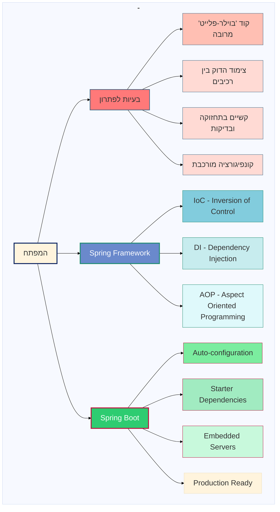
# מבוא ל-Spring Framework ו-Spring Boot

## מבוא

Spring Framework ו-Spring Boot הם שתי טכנולוגיות מובילות בעולם פיתוח יישומי Java. הטכנולוגיות הללו נועדו לפתור אתגרים משמעותיים בפיתוח יישומים מודרניים ומספקות פתרונות אלגנטיים למגוון רחב של בעיות נפוצות בפיתוח תוכנה.

## אתגרי פיתוח נפוצים

מפתחים נתקלים במספר אתגרים משמעותיים בתהליך פיתוח יישומים:

### קוד 'בוילר-פלייט' מרובה
* קוד חוזר ושגרתי שדורש כתיבה חוזרת ונשנית
* הגדרות סטנדרטיות שחוזרות בפרויקטים רבים
* פעולות שגרתיות שאינן קשורות ישירות ללוגיקה העסקית

### צימוד הדוק בין רכיבים
* תלויות הדוקות בין רכיבי המערכת השונים
* קושי בהחלפה או עדכון של רכיבים
* ארכיטקטורה נוקשה שקשה לשנות

### קשיים בתחזוקה ובדיקות
* מורכבות בכתיבת בדיקות יחידה
* קושי במעקב אחר שינויים והשפעותיהם
* אתגרים בהבנת קוד קיים ותחזוקתו

### קונפיגורציה מורכבת
* הגדרות רבות ומסובכות
* קבצי קונפיגורציה ארוכים ומורכבים
* זמן רב המושקע בהגדרות במקום בפיתוח פתרונות

## Spring Framework כפתרון

Spring Framework הוא מסגרת פיתוח המספקת פתרונות לבעיות הנ"ל באמצעות מספר עקרונות מרכזיים:

### IoC - Inversion of Control (היפוך שליטה)
* העברת האחריות לניהול אובייקטים מהקוד שלנו למסגרת עצמה
* הקונטיינר של Spring מנהל את מחזור החיים של האובייקטים
* המפתח מתמקד בלוגיקה העסקית במקום בניהול אובייקטים

### DI - Dependency Injection (הזרקת תלויות)
* הזרקת תלויות אוטומטית במקום יצירה ידנית של אובייקטים
* מאפשר צימוד חלש יותר בין רכיבי המערכת
* מקל על החלפת רכיבים ועל כתיבת בדיקות

### AOP - Aspect Oriented Programming (תכנות מונחה היבטים)
* הפרדה של נושאים חוצי מערכת (cross-cutting concerns)
* טיפול מרוכז בנושאים כמו לוגים, אבטחה וניהול טרנזקציות
* הפחתת כפילויות בקוד

## Spring Boot - הרמה הבאה

Spring Boot מתבסס על Spring Framework ומוסיף שכבה נוספת של פתרונות:

### Auto-configuration (קונפיגורציה אוטומטית)
* הגדרה אוטומטית של רכיבים לפי הצורך והסביבה
* זיהוי חכם של הספריות הקיימות בפרויקט
* הפחתה דרמטית בכמות הקוד וההגדרות הנדרשות

### Starter Dependencies (חבילות התחלה)
* חבילות מוגדרות מראש המכילות את כל התלויות הנדרשות למשימה מסוימת
* פישוט משמעותי של ניהול התלויות
* הבטחת תאימות בין הספריות השונות

### Embedded Servers (שרתים מובנים)
* שרתים מוכללים כחלק מהיישום עצמו
* אין צורך בהתקנה וקונפיגורציה נפרדת של שרתים
* פישוט תהליך הפריסה (deployment)

### Production Ready (מוכנות לסביבת ייצור)
* כלים מובנים לניטור ומעקב אחר ביצועים
* בדיקות בריאות אוטומטיות
* מטריקות וכלי ניהול מובנים

Spring Framework מספק פתרונות יסודיים לאתגרי פיתוח מרכזיים באמצעות היפוך שליטה, הזרקת תלויות ותכנות מונחה היבטים. Spring Boot בונה על יסודות אלה ומוסיף שכבה של אוטומציה, פשטות ומוכנות לסביבת ייצור.

יחד, הטכנולוגיות הללו מאפשרות למפתחים להתמקד בלוגיקה העסקית של היישום במקום להתעסק עם קוד בוילר-פלייט, קונפיגורציה מורכבת וניהול תלויות. התוצאה היא פיתוח מהיר יותר, יעיל יותר ועם פחות באגים.

הן מהוות דוגמה מצוינת לאיך מסגרות פיתוח מודרניות יכולות לפתור בעיות אמיתיות של מפתחים ולהפוך את תהליך הפיתוח לפשוט ומהנה יותר.
### מטרות הלימוד
1. היכרות עם עקרונות הבסיס של Spring Framework - IoC ו-Dependency Injection
2. הבנת היתרונות של ארכיטקטורה מבוססת שכבות
3. יצירת פרויקט Spring Boot בסיסי והבנת מבנהו
4. הכרת Spring Context ומנגנון ניהול Beans

## חלק 1: עקרונות בסיסיים של Spring Framework

### רקע ומבוא ל-Spring Framework
- ההיסטוריה של Spring והבעיות שהוא בא לפתור
- סקירת המודולים המרכזיים ב-Framework
- הקשר בין Spring Framework ל-Spring Boot

</div>

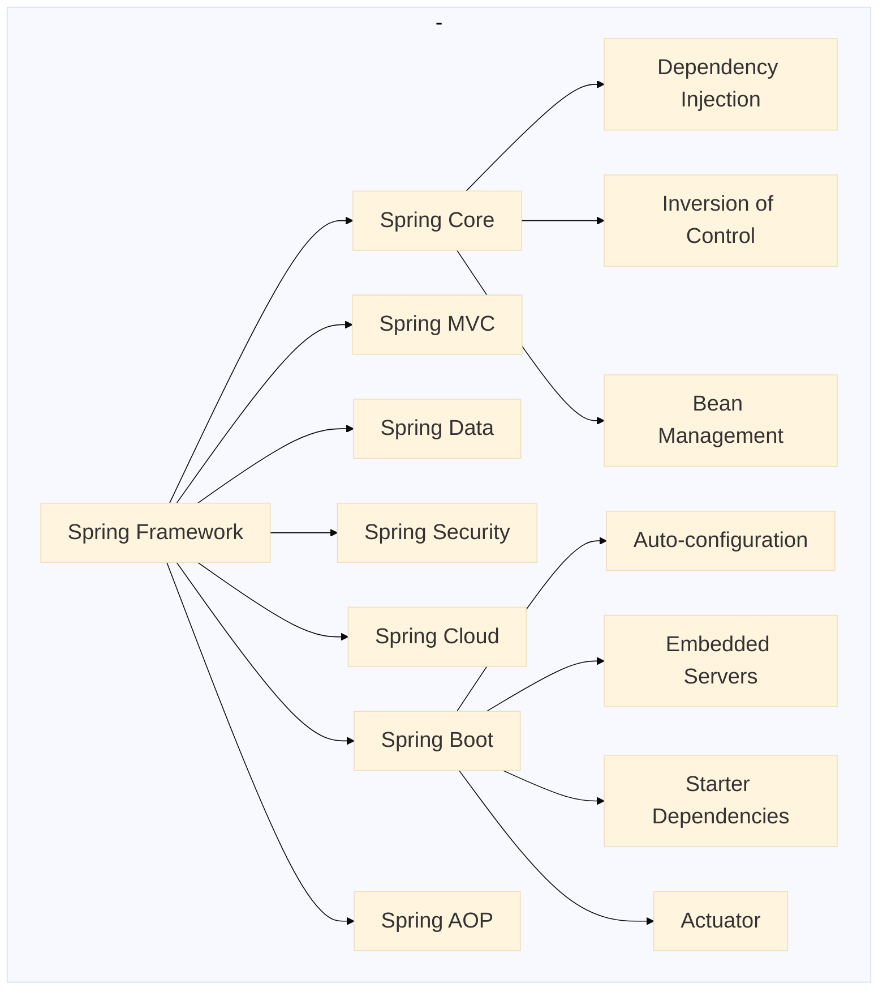

<div dir="rtl">

### עקרונות IoC ו-DI

#### Inversion of Control (IoC)
IoC היא פרדיגמת עיצוב שבה השליטה על יצירת אובייקטים וניהול מחזור החיים שלהם מועברת ממפתח האפליקציה אל מסגרת העבודה (Framework). במילים פשוטות, במקום שהקוד שלך יצור ויתחזק אובייקטים, Spring עושה זאת עבורך.

#### Dependency Injection (DI)
DI היא יישום של IoC. במקום שהאובייקטים שלך יצרו או יחפשו את התלויות שלהם, הם מקבלים אותן מבחוץ. פעולה זו מחלישה את הצימוד בין הרכיבים ומשפרת את התחזוקה ואת היכולת לבדוק את הקוד.

#### סוגי הזרקת תלויות:

</div>

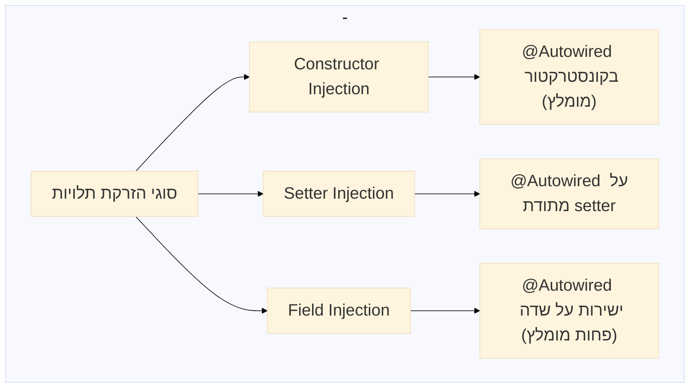

<div dir="rtl">

**דוגמה להזרקת קונסטרקטור (מומלצת):**

</div>

```java
@Service
public class StudentService {
    
    private final StudentRepository studentRepository;
    
    @Autowired // אופציונלי מאז Spring 4.3 אם יש רק קונסטרקטור אחד
    public StudentService(StudentRepository studentRepository) {
        this.studentRepository = studentRepository;
    }
    
    // שיטות השירות...
}
```

<div dir="rtl">

## חלק 2: Spring Boot

### מבוא ל-Spring Boot

Spring Boot הוא מסגרת עבודה שנועדה לפשט את פיתוח אפליקציות Spring, תוך שימוש בעיקרון "Convention over Configuration". זה מאפשר ליצור אפליקציות עצמאיות, מוכנות לשימוש בייצור, עם מינימום הגדרות.

#### יתרונות Spring Boot

</div>

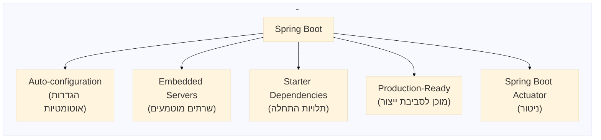

<div dir="rtl">

### יצירת פרויקט Spring Boot

ניתן ליצור פרויקט Spring Boot באמצעות:
- Spring Initializer ב-https://start.spring.io
- IntelliJ IDEA (עם תוסף Spring)
- Spring Boot CLI
- הורדה ישירה של פרויקט מוכן

### מחלקת המוצא (Main Class)

</div>

```java
package org.example.firstmeeting1;

import org.springframework.boot.SpringApplication;
import org.springframework.boot.autoconfigure.SpringBootApplication;

@SpringBootApplication
public class FirstMeeting1Application {

    public static void main(String[] args) {
        SpringApplication.run(FirstMeeting1Application.class, args);
    }
}
```

<div dir="rtl">

האנוטציה `@SpringBootApplication` משלבת שלוש אנוטציות:
- `@Configuration`: מסמן את המחלקה כמקור להגדרות Beans
- `@EnableAutoConfiguration`: מפעיל את תהליך הקונפיגורציה האוטומטית של Spring Boot
- `@ComponentScan`: מחפש רכיבי Spring (כמו `@Component`, `@Service`, `@Controller`) בחבילה הנוכחית ובתת-חבילות

### יצירת בקר בסיסי

</div>

```java
package org.example.firstmeeting1.controller;

import org.springframework.web.bind.annotation.GetMapping;
import org.springframework.web.bind.annotation.RestController;

@RestController
public class HelloController {

    @GetMapping("/")
    public String hello() {
        return "Spring Boot";
    }
    
    @GetMapping("/info")
    public String info() {
        return "Tomcat  8080";
    }
}
```

<div dir="rtl">

## חלק 3: Spring Context ו-Beans

### הבנת ה-Spring Context

Application Context הוא מיכל (Container) שמנהל את ה-Beans, מספק שירותי Dependency Injection ומנהל את מחזור החיים של הרכיבים.

#### מחזור החיים של Beans

</div>

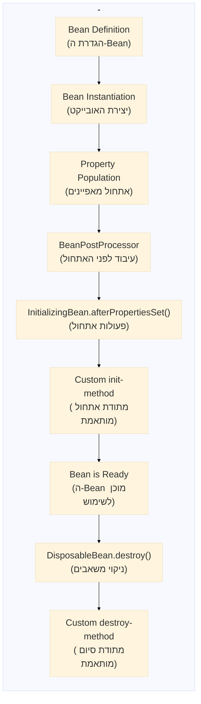

<div dir="rtl">

#### סוגי Scopes ב-Spring

- **Singleton (ברירת המחדל)**: אובייקט אחד לכל ה-ApplicationContext
- **Prototype**: אובייקט חדש בכל פעם שנדרש
- **Request**: אובייקט אחד לכל בקשת HTTP (רלוונטי לאפליקציות web)
- **Session**: אובייקט אחד לכל HTTP Session (רלוונטי לאפליקציות web)

### ניהול Beans ואופני הגדרה

#### הגדרת Beans באמצעות אנוטציות

</div>

```java
@Component  // רכיב כללי
@Service    // שירות המכיל לוגיקה עסקית
@Repository // רכיב גישה לנתונים
@Controller // בקר Web MVC
@RestController // בקר REST
@Configuration // מחלקת קונפיגורציה
```

<div dir="rtl">

#### הגדרת Beans דרך Java Configuration

</div>

```java
@Configuration
public class AppConfig {

    @Bean
    public StudentService studentService() {
        return new StudentService();
    }
    
    @Bean
    public StudentRepository studentRepository() {
        return new StudentRepository();
    }
}
```

<div dir="rtl">

## חלק 4: ארכיטקטורת שכבות בפיתוח Spring

### מבנה שכבות מומלץ

ארכיטקטורת שכבות מפרידה את האפליקציה לשכבות לוגיות, כל אחת עם אחריות ספציפית. זה מקל על התחזוקה, הבדיקה והרחבה של האפליקציה.

</div>

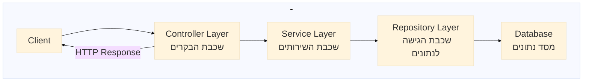

<div dir="rtl">

### תפקידי השכבות

1. **שכבת הבקרים (Controller)**:
    - קבלת בקשות HTTP וניתובן
    - תיקוף בסיסי של קלט
    - העברת הבקשה לשכבת השירות המתאימה
    - המרת תוצאות השירות לתגובת HTTP

2. **שכבת השירותים (Service)**:
    - מכילה את הלוגיקה העסקית של האפליקציה
    - מפעילה תהליכים עסקיים
    - מתאמת בין מספר repositories במידת הצורך
    - מטפלת בטרנזקציות

3. **שכבת הגישה לנתונים (Repository)**:
    - מספקת גישה למסד הנתונים
    - מפשטת את פעולות ה-CRUD (יצירה, קריאה, עדכון, מחיקה)
    - מסתירה את הפרטים הטכניים של אחסון הנתונים

### דוגמה למבנה אפליקציה

</div>

```
com.example.demo/
├── DemoApplication.java
├── controller/
│   └── StudentController.java
├── service/
│   └── StudentService.java
├── repository/
│   └── StudentRepository.java
├── model/
│   └── Student.java
├── exception/
│   └── ResourceNotFoundException.java
├── dto/
│   └── StudentDTO.java
└── config/
    └── AppConfig.java
```

<div dir="rtl">

### דוגמאות קוד לשכבות השונות

#### 1. מחלקת Model - Student

</div>

```java
package org.example.stage3.model;

public class Student {
    Long id;
    String firstName;
    String lastName;
    double age;

    public Student() {
    }

    public Student(Long id, String firstName, String lastName, double age) {
        this.id = id;
        this.firstName = firstName;
        this.lastName = lastName;
        this.age = age;
    }

    // Getters and Setters
    public Long getId() {
        return id;
    }

    public void setId(Long id) {
        this.id = id;
    }

    public String getFirstName() {
        return firstName;
    }

    public void setFirstName(String firstName) {
        this.firstName = firstName;
    }

    public String getLastName() {
        return lastName;
    }

    public void setLastName(String lastName) {
        this.lastName = lastName;
    }

    public double getAge() {
        return age;
    }

    public void setAge(double age) {
        this.age = age;
    }

    @Override
    public String toString() {
        return "Student{" +
                "id=" + id +
                ", firstName='" + firstName + '\'' +
                ", lastName='" + lastName + '\'' +
                ", age=" + age +
                '}';
    }
}
```

<div dir="rtl">

#### 2. שכבת השירות - StudentService

</div>

```java
package org.example.stage3.service;

import org.example.stage3.model.Student;
import org.springframework.stereotype.Service;

import java.util.ArrayList;
import java.util.Arrays;
import java.util.List;

@Service
public class StudentService {

    List<Student> students = new ArrayList<>(Arrays.asList(
        new Student(1L, "Alice", "Moskovitz", 21.3),
        new Student(2L, "Bob", "Smith", 22.3),
        new Student(3L, "Charlie", "Brown", 23.3),
        new Student(4L, "David", "Miller", 24.3)
    ));

    public List<Student> getAllStudents() {
        return students;
    }
}
```

<div dir="rtl">

#### 3. שכבת הבקר - StudentController

</div>

```java
package org.example.stage3.controller;

import org.example.stage3.model.Student;
import org.example.stage3.service.StudentService;
import org.springframework.web.bind.annotation.GetMapping;
import org.springframework.web.bind.annotation.RequestMapping;
import org.springframework.web.bind.annotation.RestController;

import java.util.List;

@RestController
@RequestMapping("/student")
public class StudentController {

    private final StudentService studentService;

    public StudentController(StudentService studentService) {
        this.studentService = studentService;
    }

    @GetMapping("/getAllStudents")
    public List<Student> getAllStudents() {
        return studentService.getAllStudents();
    }
}
```

<div dir="rtl">

## חלק 5: מערכת טיפול בשגיאות ב-Spring Boot

### מבוא

טיפול בשגיאות הוא חלק קריטי מכל אפליקציית מקצועית. ב-Spring Boot, קיים מנגנון מתקדם לטיפול בחריגות (Exceptions) שמאפשר לייצר תגובות שגיאה עקביות ומובנות.

### הזרימה של טיפול בשגיאות

</div>

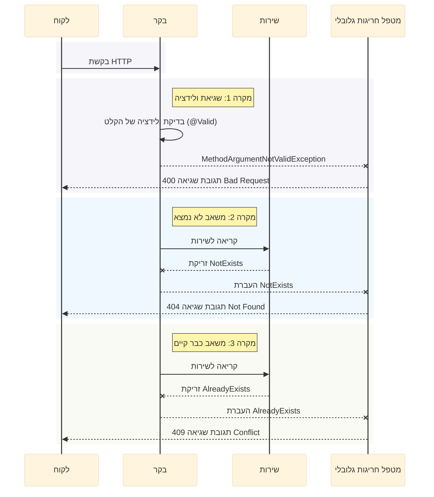

<div dir="rtl">

### רכיבי מערכת הטיפול בחריגות

#### 1. חריגות מותאמות אישית

</div>

```java
package org.example.stage5_2.exception;

public class NotExists extends RuntimeException {
    public NotExists(String message) {
        super(message);
    }
}

public class AlreadyExists extends RuntimeException {
    public AlreadyExists(String message) {
        super(message);
    }
}

public class StudentIdAndIdMismatch extends RuntimeException {
    public StudentIdAndIdMismatch(String message) {
        super(message);
    }
}
```

<div dir="rtl">

#### 2. מחלקת תגובת שגיאה

</div>

```java
package org.example.stage5_2.model;

import lombok.Data;
import java.time.LocalDateTime;

@Data
public class ErrorResponse {
    private String error;
    private String message;
    private LocalDateTime timestamp;

    public ErrorResponse(String error, String message) {
        this.error = error;
        this.message = message;
        this.timestamp = LocalDateTime.now();
    }
}
```

<div dir="rtl">

#### 3. מטפל חריגות גלובלי

</div>

```java
package org.example.stage5_2.exception;

import org.example.stage5_2.model.ErrorResponse;
import org.springframework.http.HttpStatus;
import org.springframework.http.ResponseEntity;
import org.springframework.web.bind.MethodArgumentNotValidException;
import org.springframework.web.bind.annotation.ControllerAdvice;
import org.springframework.web.bind.annotation.ExceptionHandler;

import java.util.HashMap;
import java.util.Map;

@ControllerAdvice
public class GlobalExceptionHandler {

    @ExceptionHandler(NotExists.class)
    public ResponseEntity<Object> handleNotExists(NotExists ex) {
        return ResponseEntity
                .status(HttpStatus.NOT_FOUND)
                .body(new ErrorResponse("Resource Not Found", ex.getMessage()));
    }

    @ExceptionHandler(AlreadyExists.class)
    public ResponseEntity<Object> handleAlreadyExists(AlreadyExists ex) {
        return ResponseEntity
                .status(HttpStatus.CONFLICT)
                .body(new ErrorResponse("Resource Conflict", ex.getMessage()));
    }

    @ExceptionHandler(StudentIdAndIdMismatch.class)
    public ResponseEntity<Object> handleIdMismatch(StudentIdAndIdMismatch ex) {
        return ResponseEntity
                .status(HttpStatus.BAD_REQUEST)
                .body(new ErrorResponse("ID Mismatch", ex.getMessage()));
    }

    @ExceptionHandler(Exception.class)
    public ResponseEntity<Object> handleGenericException(Exception ex) {
        return ResponseEntity
                .status(HttpStatus.INTERNAL_SERVER_ERROR)
                .body(new ErrorResponse("Internal Server Error", ex.getMessage()));
    }

    @ExceptionHandler(MethodArgumentNotValidException.class)
    public ResponseEntity<ErrorResponse> handleValidationExceptions(MethodArgumentNotValidException ex) {
        Map<String, String> errors = new HashMap<>();

        ex.getBindingResult().getFieldErrors().forEach(error ->
                errors.put(error.getField(), error.getDefaultMessage())
        );

        ErrorResponse errorResponse = new ErrorResponse(
                "Validation Failed",
                errors.toString()
        );

        return ResponseEntity.badRequest().body(errorResponse);
    }
}
```

<div dir="rtl">

### קודי סטטוס HTTP ושימושם

מערכת הטיפול בחריגות משתמשת בקודי סטטוס HTTP שונים בהתאם לסוג השגיאה:

</div>

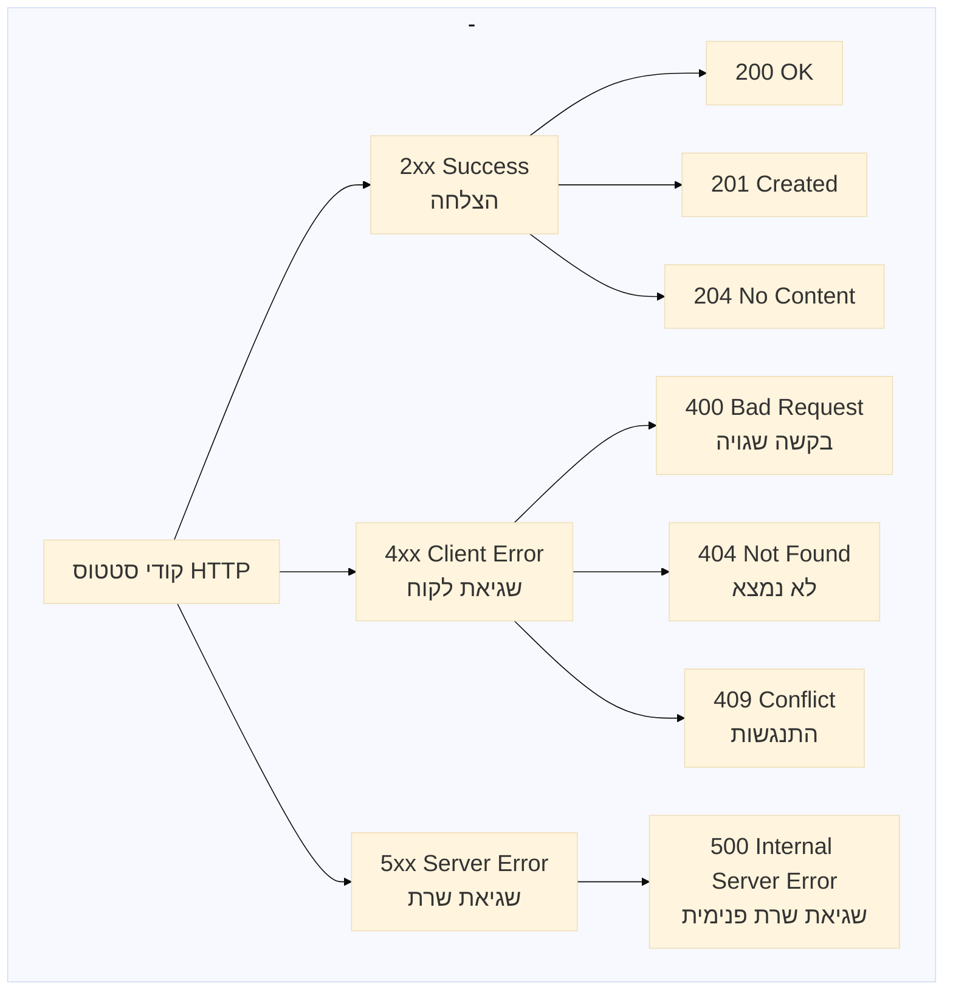

<div dir="rtl">

- **400 Bad Request**: שגיאות ולידציה וקלט לא תקין (כמו אי התאמה בין מזהים)
- **404 Not Found**: משאב מבוקש לא נמצא
- **409 Conflict**: ניסיון ליצור משאב עם מזהה שכבר קיים
- **500 Internal Server Error**: שגיאות כלליות או לא צפויות

### דוגמאות לתגובות שגיאה

#### 1. שגיאת ולידציה (400 Bad Request)

</div>

```json
{
  "error": "Validation Failed",
  "message": "{firstName=First name must be between 2 and 50 characters, age=Age must be a positive number}",
  "timestamp": "2025-03-16T14:32:45.123"
}
```

<div dir="rtl">

#### 2. משאב לא נמצא (404 Not Found)

</div>

```json
{
  "error": "Resource Not Found",
  "message": "Student with id 100 does not exist",
  "timestamp": "2025-03-16T14:33:12.456"
}
```

<div dir="rtl">

#### 3. משאב כבר קיים (409 Conflict)

</div>

```json
{
  "error": "Resource Conflict",
  "message": "Student with id 1 already exists",
  "timestamp": "2025-03-16T14:33:50.789"
}
```

<div dir="rtl">

## חלק 6: שימוש ב-ResponseEntity

### מהו ResponseEntity?

`ResponseEntity` הוא קלאס מספריית Spring המאפשר שליטה מלאה בתגובת HTTP שמוחזרת מבקר REST. באמצעותו ניתן להגדיר את הגוף, הכותרות וקוד הסטטוס של התגובה.

### יתרונות השימוש ב-ResponseEntity

* שליטה מלאה בקוד הסטטוס של HTTP
* הוספת כותרות HTTP לתגובה
* החזרת גוף התגובה במבנה מותאם
* שיפור האינטגרציה עם ממשקי REST
* עיטוף מאובטח של תגובות

### דוגמה בסיסית

</div>

```java
@GetMapping("/getAllStudents")
public ResponseEntity<List<Student>> getAllStudents() {
    List<Student> studentList = studentService.getAllStudents();
    return ResponseEntity.ok(studentList); // 200 OK
}
```

<div dir="rtl">

### מתודות שימושיות ב-ResponseEntity

</div>

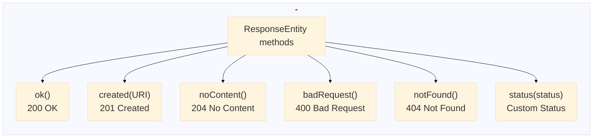

<div dir="rtl">

### דוגמאות לשימוש במתודות שונות

#### החזרת סטטוס הצלחה עם גוף תגובה

</div>

```java
@GetMapping("/getAllStudents")
public ResponseEntity<List<Student>> getAllStudents() {
    List<Student> studentList = studentService.getAllStudents();
    return ResponseEntity.ok(studentList);
}
```

<div dir="rtl">

#### החזרת סטטוס יצירה (201) עם URI למשאב החדש

</div>

```java
@PostMapping("/addStudent")
public ResponseEntity<Object> addStudent(@RequestBody Student student) {
    try {
        Student added = studentService.addStudent(student);

        URI location = ServletUriComponentsBuilder
            .fromCurrentRequest()
            .path("/{id}")
            .buildAndExpand(added.getId())
            .toUri();

        return ResponseEntity.created(location).body(added); // 201 Created
    } catch (AlreadyExists e) {
        return ResponseEntity.status(HttpStatus.CONFLICT).body(new ErrorResponse("Resource Conflict", e.getMessage()));
    }
}
```

<div dir="rtl">

#### החזרת תגובה ללא תוכן

</div>

```java
@DeleteMapping("/deleteStudent/{id}")
public ResponseEntity<Object> deleteStudent(@PathVariable Long id) {
    try {
        studentService.deleteStudent(id);
        return ResponseEntity.noContent().build(); // 204 No Content
    } catch (NotExists e) {
        return ResponseEntity.notFound().build();
    }
}
```

<div dir="rtl">

## חלק 7: התמודדות עם בעיות נפוצות בהרצת Spring Boot

### בעיות נפוצות ופתרונות

</div>

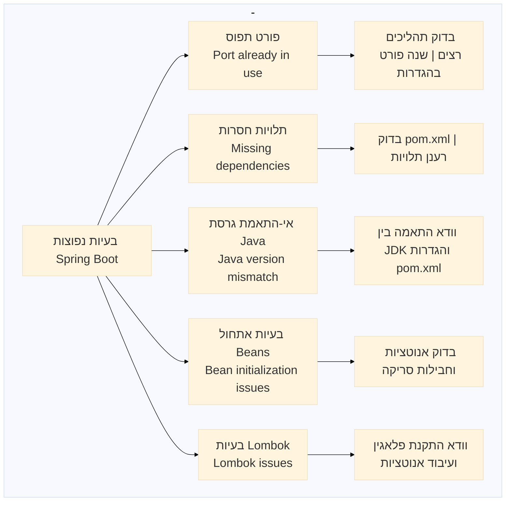

<div dir="rtl">

#### בעיית פורט (Port) תפוס
**שגיאה:**
```
Web server failed to start. Port 8080 was already in use.
```

**פתרונות:**
- שינוי הפורט בקובץ `application.properties`:
  ```properties
  server.port=8081
  ```

#### בעיות תלויות Maven חסרות
**שגיאה:**
```
java.lang.NoClassDefFoundError: org/springframework/...
```

**פתרונות:**
- בדיקת תקינות ה-pom.xml ועדכונו
- רענון ידני של תלויות ב-IDE

#### כיצד לפתור בעיות Spring Boot בצורה שיטתית

1. **לבדוק את הלוגים בקפידה** - רוב הבעיות מוסברות בלוגים
2. **לבחון את ה-stack trace** - עקוב אחר השגיאה מלמעלה למטה
3. **בדיקת תלויות** - האם כל התלויות הנדרשות קיימות?
4. **בדיקת אנוטציות** - האם האנוטציות הנכונות מוגדרות בכל המחלקות?
5. **נתיבי חבילות** - האם המחלקות נמצאות בנתיבים הנכונים?

## סיכום

ארכיטקטורת Spring Boot מספקת מסגרת חזקה לפיתוח אפליקציות Java מודרניות. היא משלבת את העושר והגמישות של Spring Framework עם פשטות ההגדרה והמוכנות לייצור.

### יתרונות עיקריים של Spring Boot

1. **פיתוח מהיר** - אוטו-קונפיגורציה וסטרטרים מפחיתים זמן הגדרה
2. **הפרדת אחריות** - ארכיטקטורת שכבות מבטיחה קוד מאורגן ותחזוקתי
3. **ניהול תלויות חכם** - פתרון אוטומטי לקונפליקטים של גרסאות
4. **מערכת מודולרית** - הוספה וגריעה של רכיבים מבלי להשפיע על הקיים
5. **מוכנות לייצור** - כלי ניטור, מטריקות ובריאות מובנים
6. **אקוסיסטם עשיר** - אינטגרציה מובנית עם טכנולוגיות נפוצות

### מושגי מפתח שסקרנו

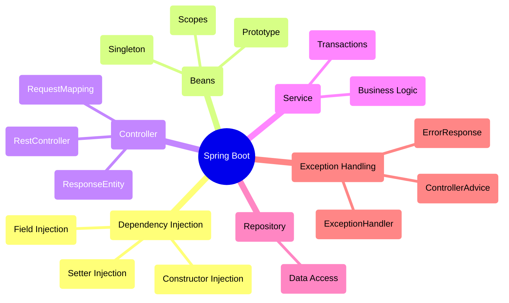

### דרכים להרחבת הידע

1. **קורסים מקוונים** - ישנם מגוון רחב של קורסי Spring Boot מקוונים במגוון רמות
2. **תיעוד רשמי** - תיעוד Spring Boot הרשמי מכיל מידע והדרכות מצוינות
3. **ספרות מקצועית** - ספרים כמו "Spring Boot in Action" או "Spring Microservices in Action"
4. **מאמרים ובלוגים** - Baeldung, DZone, ו-Medium מכילים מאמרים מעודכנים על Spring Boot
5. **פרויקטים מעשיים** - התנסות אישית בפרויקטים קטנים שהולכים ומתרחבים

## מקורות מומלצים

- הדוקומנטציה הרשמית של [Spring Framework](https://docs.spring.io/spring-framework/reference/)
- הדוקומנטציה הרשמית של [Spring Boot](https://docs.spring.io/spring-boot/docs/current/reference/html/)
- מדריכים ב-Baeldung: [https://www.baeldung.com/spring-boot](https://www.baeldung.com/spring-boot)
- Spring Boot Guides: [https://spring.io/guides](https://spring.io/guides)
- Spring Initializr: [https://start.spring.io](https://start.spring.io)

## הערות סיום

זכרו כי עקרונות התכנון הבסיסיים חשובים גם בפיתוח Spring Boot:
- **SOLID Principles** - עקרונות תכנון מוצק
- **DRY (Don't Repeat Yourself)** - הימנעו מכפילויות קוד
- **KISS (Keep It Simple, Stupid)** - שמרו על פשטות
- **Separation of Concerns** - הפרדת אחריות בין רכיבים

הבנת העקרונות האלה בשילוב עם הכרת הכלים והיכולות של Spring Boot יאפשרו לכם לפתח אפליקציות איכותיות, תחזוקתיות וחסינות לאורך זמן.