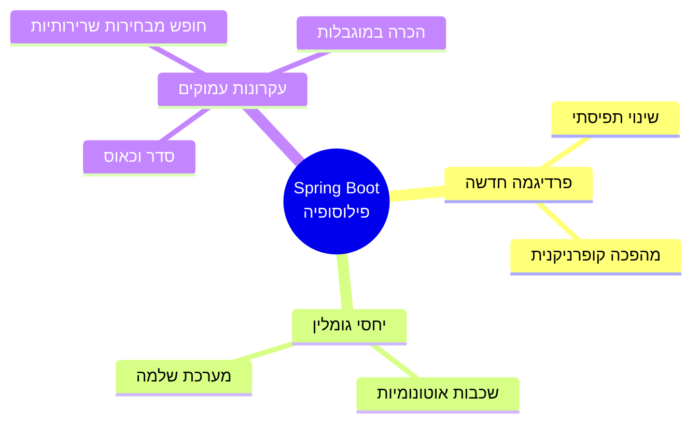
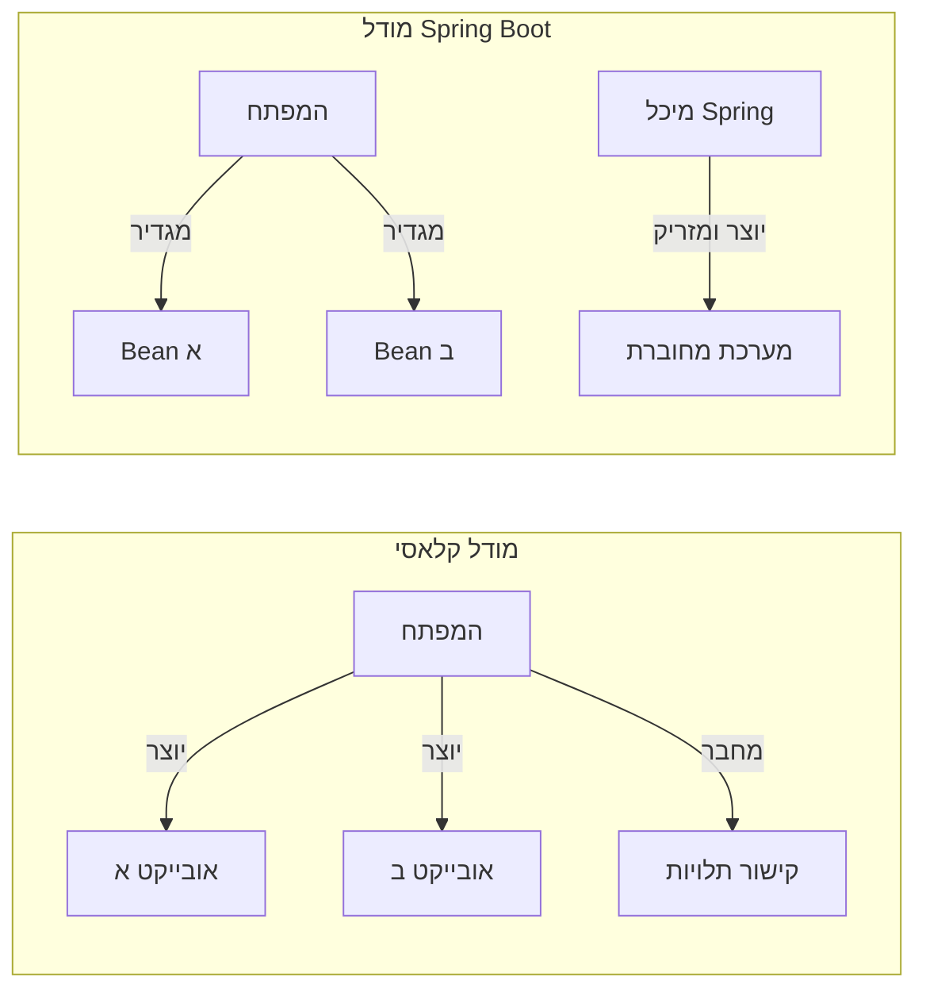
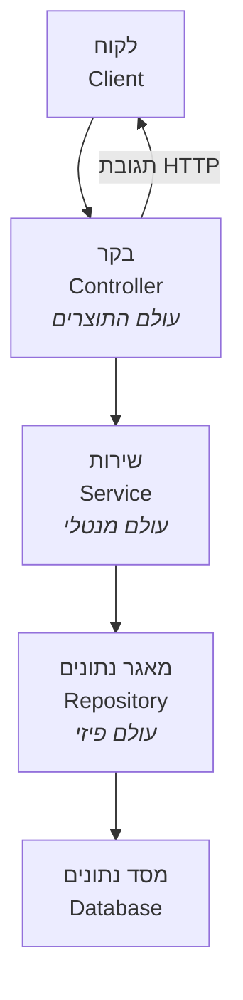
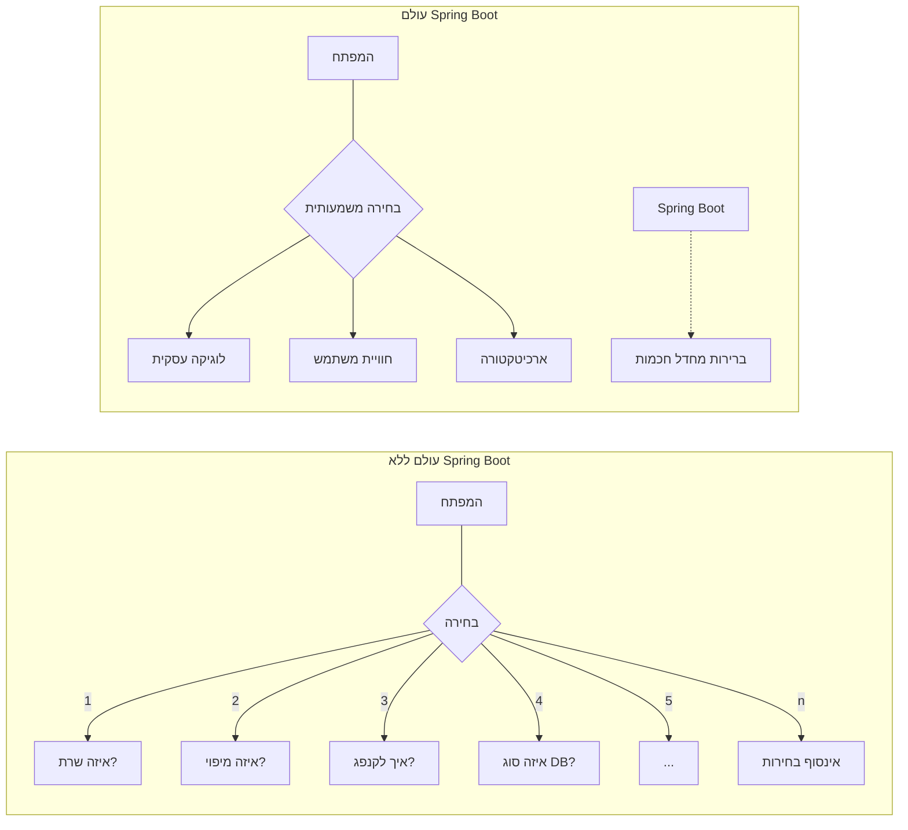
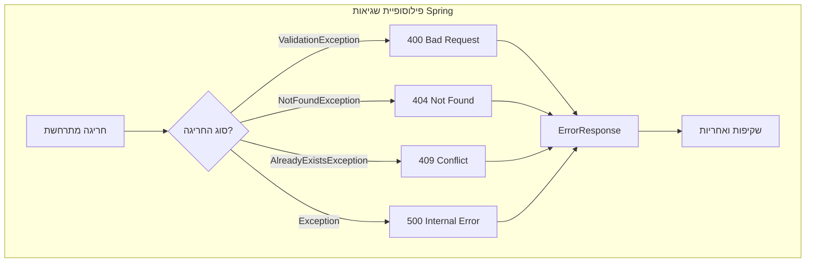
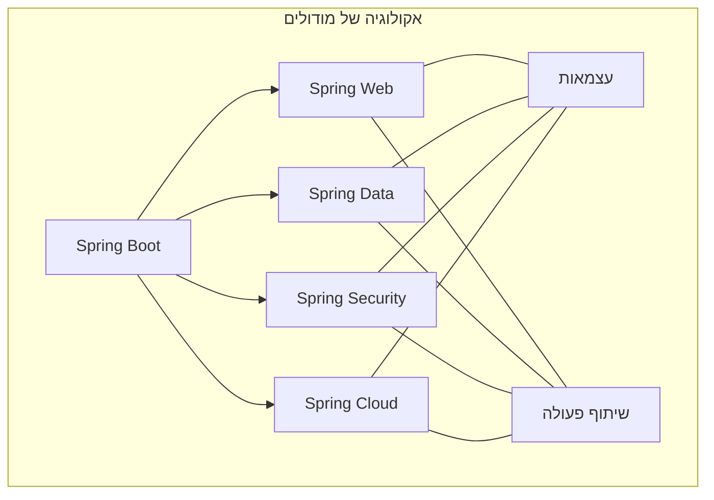
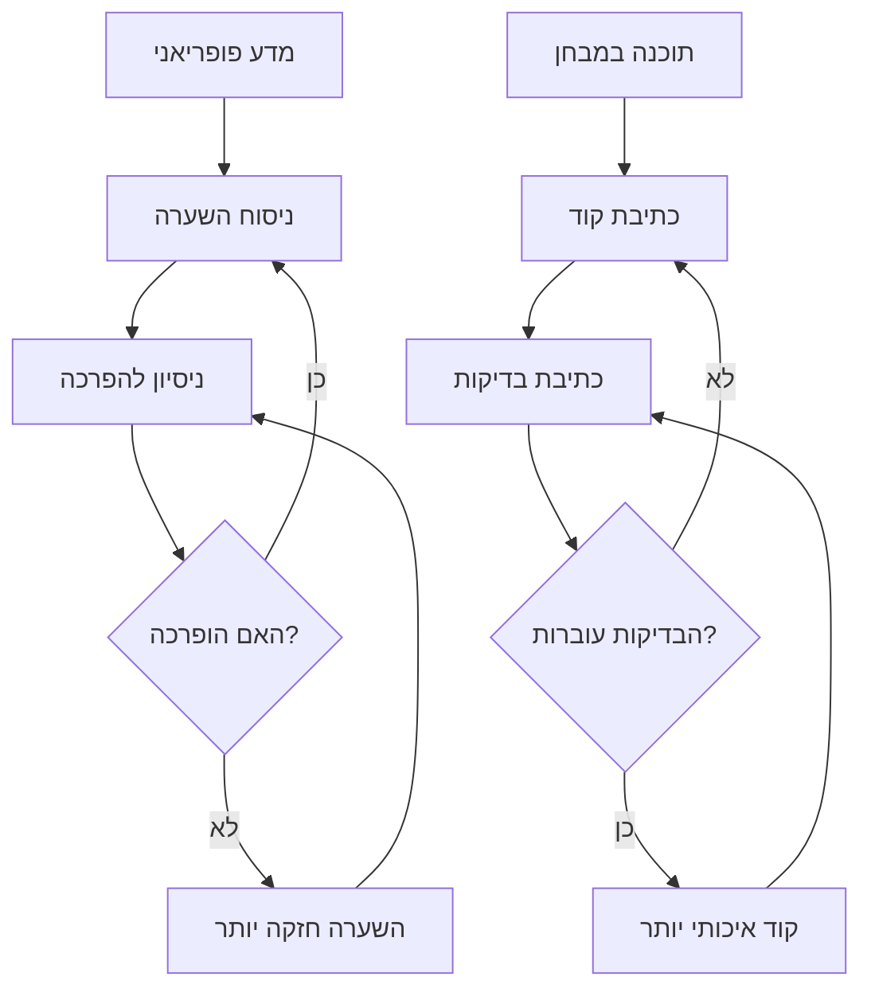
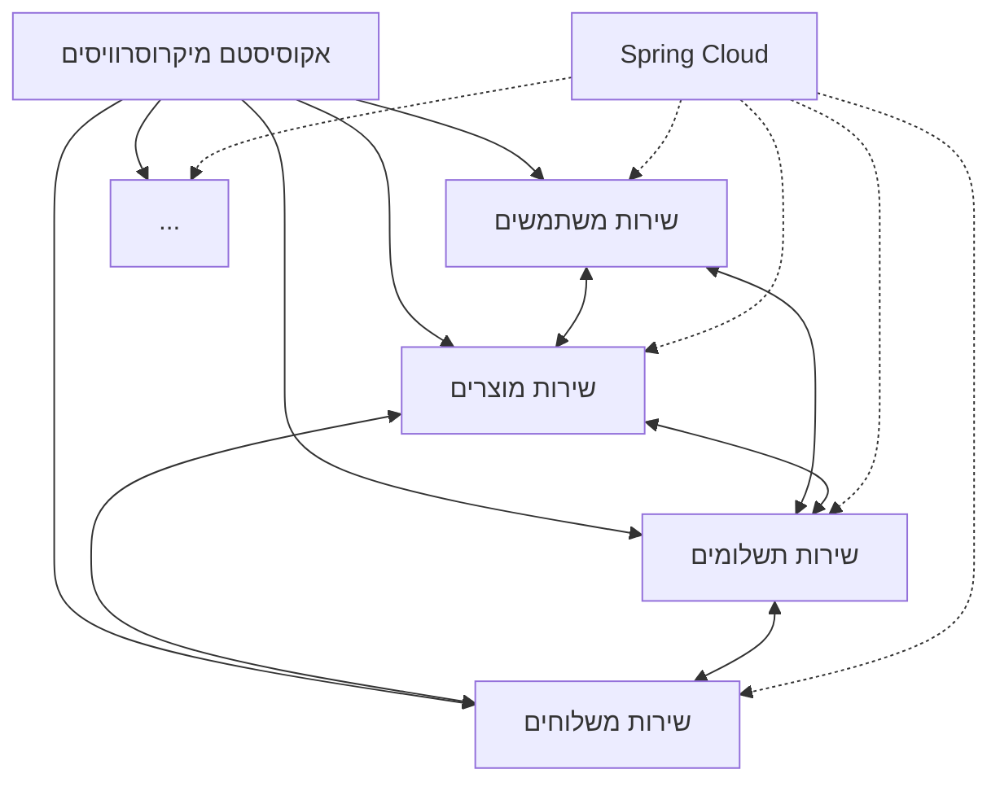

<div dir="rtl">

# הפילוסופיה של Spring Boot: מהפכה מחשבתית בפיתוח אפליקציות

> "אל תשתמש בתבנית רק בגלל שהיא פופולרית [...] החליטו על ארכיטקטורה שנכונה לבעיה שאתם מנסים לפתור."  
> &mdash; [רוד ג'ונסון](https://en.wikipedia.org/wiki/Rod_Johnson_(computer_programmer)), יוצר מסגרת [Spring](https://spring.io/projects/spring-framework)

## מבוא: מעבר לטכנולוגיה



בבסיסו של [Spring Boot](https://spring.io/projects/spring-boot) עומדת תפיסה פילוסופית שמחוללת מהפכה בדרך שבה אנו חושבים על פיתוח תוכנה. זו אינה רק טכנולוגיה, אלא תפיסת עולם שמנחה את המפתח דרך סבך האתגרים המורכבים של בניית אפליקציות מודרניות.

כפי שהפילוסוף המדעי [תומאס קון](https://en.wikipedia.org/wiki/Thomas_Kuhn) הציע ב"[המבנה של מהפכות מדעיות](https://plato.stanford.edu/entries/thomas-kuhn/#StrSciRev)", גם בפיתוח תוכנה אנו עדים ל"[שינויי פרדיגמה](https://en.wikipedia.org/wiki/Paradigm_shift)" – מעברים מתפיסה אחת של העולם לאחרת. Spring Boot מייצג שינוי פרדיגמה כזה.

## עקרון ההפוך של שליטה (Inversion of Control)

> "הגאונות האמיתית אינה בעשייה, אלא בראיית האחר."  
> &mdash; [עמנואל לוינס](https://he.wikipedia.org/wiki/%D7%A2%D7%9E%D7%A0%D7%95%D7%90%D7%9C_%D7%9C%D7%95%D7%99%D7%A0%D7%A1), [מתוך "אתיקה והאינסופי"](https://plato.stanford.edu/entries/levinas/)



במהותה, Spring Boot מציעה היפוך פרדיגמטי: במקום שהמפתח יהיה אחראי לניהול מחזור החיים של האובייקטים, המערכת היא שמנהלת אותם. זוהי מעין ["הפיכה קופרניקנית"](https://en.wikipedia.org/wiki/Copernican_Revolution#Metaphorical_usage) בפיתוח תוכנה - לא האובייקטים סובבים סביב הקוד שלנו, אלא הקוד שלנו מוכל בתוך מערכת רחבה יותר.

כמו שהפילוסוף [עמנואל קאנט](https://plato.stanford.edu/entries/kant/) הציע ב["ביקורת התבונה הטהורה"](https://en.wikipedia.org/wiki/Critique_of_Pure_Reason) שהידע שלנו לא נובע מהעולם החיצוני אלא מהקטגוריות שבאמצעותן אנו תופסים אותו, כך [Spring מציע](https://docs.spring.io/spring-framework/reference/core/beans/introduction.html) שהלוגיקה העסקית של האפליקציה אינה צריכה להתעסק עם יצירה וניהול של משאבים, אלא להתמקד בערך העסקי הייחודי שהיא מספקת:

</div>

```java
// במקום ליצור תלויות בעצמנו:
DatabaseConnection conn = new DatabaseConnection();
UserRepository userRepo = new UserRepository(conn);
EmailService emailService = new EmailService();
UserService userService = new UserService(userRepo, emailService);

// Spring דואג להזרקת התלויות:
@Service
public class UserService {
    private final UserRepository userRepository;
    private final EmailService emailService;
    
    // Spring יוצר ומזריק את התלויות אוטומטית
    public UserService(UserRepository userRepository, EmailService emailService) {
        this.userRepository = userRepository;
        this.emailService = emailService;
    }
}
```

<div dir="rtl">

היפוך השליטה הזה מהדהד את התפיסה [הפנומנולוגית](https://plato.stanford.edu/entries/phenomenology/) של [אדמונד הוסרל](https://plato.stanford.edu/entries/husserl/) על ["הסוגריים הפנומנולוגיים"](https://en.wikipedia.org/wiki/Bracketing_(phenomenology)) (bracketing) - הסטת תשומת הלב מהאובייקטים עצמם אל האופן שבו אנו מתייחסים אליהם.

## הפרדה לשכבות כביטוי לסדר קוסמי

> "בעולם המושלם, כל דבר הוא הרמוני עם טבעו ותכליתו."  
> &mdash; [אריסטו](https://plato.stanford.edu/entries/aristotle/), [מתוך ה"אתיקה הניקומאכית"](https://en.wikipedia.org/wiki/Nicomachean_Ethics)



ארכיטקטורת השכבות ב-Spring ([Controller](https://docs.spring.io/spring-framework/reference/web/webmvc/mvc-controller.html), [Service](https://docs.spring.io/spring-framework/reference/core/beans/classpath-scanning.html#beans-stereotype-annotations), [Repository](https://docs.spring.io/spring-data/jpa/docs/current/reference/html/#repositories)) מהדהדת את התפיסה האריסטוטלית של [סדר טבעי](https://plato.stanford.edu/entries/aristotle-ethics/#HumaNatuVirtuHapp). כל שכבה מתמקדת בתפקיד אחד, ובכך משיגה מצוינות בתחומה. זוהי ארכיטקטורה שמבטאת הרמוניה, שבה כל רכיב יודע את מקומו ותפקידו בקוסמוס של האפליקציה.

הבקר (Controller) מתפקד כמתווך בין העולם החיצוני לעולם הפנימי, כמו שכל האדם מתווך בין רשמי החושים לבין ההבנה שלנו, בתפיסה [הקאנטיאנית](https://plato.stanford.edu/entries/kant-metaphysics/). השירות (Service) מכיל את הלוגיקה העסקית - את ה"רוח" של האפליקציה, במונחים [הגליאניים](https://plato.stanford.edu/entries/hegel/). המאגר (Repository) מתקשר עם העולם העיקש של הנתונים המתמידים.

באופן מעניין, ארכיטקטורה זו משקפת גם את תפיסת ["שלוש השכבות של המציאות"](https://plato.stanford.edu/entries/popper/#ThreeWorlds) של הפילוסוף [קרל פופר](https://plato.stanford.edu/entries/popper/) מספרו "[הידע האובייקטיבי](https://en.wikipedia.org/wiki/Objective_Knowledge)":

1. **העולם הפיזי** (ה-database וה-Repository שמשקף אותו)
2. **העולם המנטלי** (הלוגיקה העסקית ב-Service)
3. **העולם של התוצרים האובייקטיביים של התודעה** (ה-API המוצג ע"י ה-Controller)

## Convention Over Configuration: שחרור מבחירות שרירותיות

> "אנו נידונים לחופש"  
> &mdash; [ז'אן-פול סארטר](https://plato.stanford.edu/entries/sartre/), [מתוך "ההוויה והאין"](https://en.wikipedia.org/wiki/Being_and_Nothingness)



העיקרון של ["מוסכמות במקום קונפיגורציה"](https://en.wikipedia.org/wiki/Convention_over_configuration) (Convention over Configuration) משקף את הרעיון האקזיסטנציאליסטי שהאדם משתוקק להשתחרר מהצורך לבחור בחירות שרירותיות. Spring Boot קובע מסגרת של החלטות סבירות, ובכך משחרר את המפתח להתמקד בהחלטות משמעותיות באמת.

זוהי מעין גרסה פרקטית של ["האדם נידון לחופש"](https://en.wikipedia.org/wiki/Existentialism_Is_a_Humanism) של סארטר - Spring Boot משחרר אותנו מהצורך לקבל אינספור החלטות טכניות שרירותיות, כדי שנוכל להתמקד בחופש האמיתי: היצירה והחדשנות.

[הנס גאורג גאדאמר](https://plato.stanford.edu/entries/gadamer/), הפילוסוף ההרמנויטי, טען בספרו ["אמת ושיטה"](https://en.wikipedia.org/wiki/Truth_and_Method) שכל הבנה מתרחשת בתוך מסורת ו"[אופק](https://en.wikipedia.org/wiki/Fusion_of_horizons)" של ציפיות והנחות קודמות. באותו אופן, Spring Boot יוצר "אופק" של מוסכמות שבתוכו המפתח יכול להתמקד בפרשנות היצירתית שלו למשימה העסקית.


</div>

```
// ללא Spring Boot, היינו צריכים להגדיר עשרות פרמטרים:
Server server = new Server();
server.setPort(8080);
ConnectionPool pool = new ConnectionPool();
pool.setMaxConnections(100);
pool.setConnectionTimeout(30000);
// ... עוד עשרות שורות של קונפיגורציה

// עם Spring Boot:
@SpringBootApplication
public class MyApp {
    public static void main(String[] args) {
        SpringApplication.run(MyApp.class, args);
    }
}
// זהו! כל שאר ההגדרות הן ברירות מחדל חכמות
```

<div dir="rtl">

## טיפול בשגיאות כהכרה במוגבלות האנושית

> "אל תחשוש מפני השגיאות. אין ידע ללא שגיאות."  
> &mdash; [קרל פופר](https://en.wikipedia.org/wiki/Karl_Popper), [מתוך "ניחושים והפרכות"](https://en.wikipedia.org/wiki/Conjectures_and_Refutations)



הטיפול המובנה בשגיאות ב-Spring Boot ([GlobalExceptionHandler](https://spring.io/blog/2013/11/01/exception-handling-in-spring-mvc)) מכיר בכך שהשגיאה היא חלק אינהרנטי מהמציאות התוכנתית. במקום להתייחס לשגיאות כאל "תקלות", Spring Boot מתייחס אליהן כחלק מובנה מהמערכת, שדורש טיפול מסודר:


</div>

```java
@ControllerAdvice
public class GlobalExceptionHandler {
    @ExceptionHandler(ResourceNotFoundException.class)
    public ResponseEntity<ErrorMessage> handleResourceNotFound(Exception ex) {
        // טיפול אלגנטי בשגיאה
        return ResponseEntity.status(404).body(new ErrorMessage(ex.getMessage()));
    }
}
```


<div dir="rtl">


גישה זו מהדהדת את הפילוסופיה של [מרטין היידגר](https://plato.stanford.edu/entries/heidegger/) על ה"[Being-towards-death](https://en.wikipedia.org/wiki/Heideggerian_terminology#Being-toward-death)" מספרו ["הוויה וזמן"](https://en.wikipedia.org/wiki/Being_and_Time) - ההכרה במוגבלות שלנו אינה חולשה אלא מקור לאותנטיות. כך גם בתוכנה - ההכרה בכך ששגיאות יקרו והטיפול המסודר בהן היא חלק מהבשלות של המערכת.

[לודוויג ויטגנשטיין](https://plato.stanford.edu/entries/wittgenstein/) טען ב["מאמר לוגי-פילוסופי"](https://en.wikipedia.org/wiki/Tractatus_Logico-Philosophicus) שהשפה קובעת את גבולות העולם שלנו. באותו אופן, מערכת הטיפול בשגיאות של Spring Boot יוצרת "שפה" שבה ניתן לתקשר עם המשתמשים אודות גבולות המערכת באופן ברור, עקבי ומכבד.

## מודולריות כביטוי לאוטונומיה ופלורליזם

> "החירות של האחד מסתיימת במקום שבו מתחילה החירות של האחר."  
> &mdash; [ג'ון סטיוארט מיל](https://plato.stanford.edu/entries/mill/), [מעקרונות "על החירות"](https://en.wikipedia.org/wiki/On_Liberty)



הגישה המודולרית של Spring Boot, עם [Starters](https://docs.spring.io/spring-boot/docs/current/reference/htmlsingle/#using.build-systems.starters) וחבילות שניתנות להחלפה, מזכירה את הפלורליזם של הפילוסוף [ישעיהו ברלין](https://plato.stanford.edu/entries/berlin/). ברלין האמין במגוון ערכים שאינם ניתנים לצמצום לכדי מערכת אחידה, כפי שהציג במאמרו הידוע ["שני מושגים של חירות"](https://en.wikipedia.org/wiki/Two_Concepts_of_Liberty), וכך גם Spring Boot מעודד מגוון של גישות ופתרונות טכנולוגיים.


</div>


```xml
<!-- רק שורה אחת במקום עשרות תלויות -->
<dependency>
    <groupId>org.springframework.boot</groupId>
    <artifactId>spring-boot-starter-web</artifactId>
</dependency>
```

<div dir="rtl">

זוהי גם גישה המעוגנת ב"[עקרון האחריות היחידה](https://en.wikipedia.org/wiki/Single-responsibility_principle)" (SRP) - כל מודול אחראי על היבט אחד בלבד של המערכת. עיקרון זה משקף את הפלורליזם המתודולוגי של הפילוסוף [פול פיירבנד](https://plato.stanford.edu/entries/feyerabend/), שטען בספרו ["נגד השיטה"](https://en.wikipedia.org/wiki/Against_Method) שאין שיטה אחת נכונה לעשיית מדע, אלא מגוון שיטות המתאימות להקשרים שונים.

## פיתוח מבוסס בדיקות כהכרה באפיסטמולוגיה של פופר

> "תיאוריה שאי אפשר להפריך אינה תיאוריה מדעית כלל."  
> &mdash; [קרל פופר](https://plato.stanford.edu/entries/popper/), [מתוך "הלוגיקה של גילוי מדעי"](https://en.wikipedia.org/wiki/The_Logic_of_Scientific_Discovery)



הדגש של Spring Boot על [בדיקות אוטומטיות](https://docs.spring.io/spring-boot/docs/current/reference/html/features.html#features.testing) ו-[Test-Driven Development](https://en.wikipedia.org/wiki/Test-driven_development) מהדהד את האפיסטמולוגיה של קרל פופר, שטען שהידע המדעי מתקדם דרך ניסיונות להפריך תיאוריות. כפי שפופר הציע את עקרון ה"[falsifiability](https://en.wikipedia.org/wiki/Falsifiability)" (הפרכה), כך גם פיתוח מבוסס בדיקות מבוסס על הרעיון שאנו מתקדמים על-ידי בדיקת הגבולות של המערכת שלנו.


</div>

```java
@Test
void createUser_withValidData_shouldReturnCreatedUser() {
    // given
    UserDto userDto = new UserDto("test@example.com", "John", "Doe");
    
    // when
    UserDto result = userService.createUser(userDto);
    
    // then
    assertThat(result).isNotNull();
    assertThat(result.getId()).isNotNull();
}
```

<div dir="rtl">

בדיקות יחידה והאינטגרציה הן כמו ניסויים מדעיים - הם מנסים להפריך את ההשערה שהקוד עובד כמצופה. כישלון הבדיקה אינו כישלון של המפתח, אלא התקדמות בהבנה שלנו את המערכת.

## Aspect-Oriented Programming: מבט הוליסטי

> "השלם גדול מסכום חלקיו."  
> &mdash; [אריסטו](https://plato.stanford.edu/entries/aristotle-metaphysics/), [מתוך "מטאפיזיקה"](https://en.wikipedia.org/wiki/Metaphysics_(Aristotle))

```mermaid
graph TD
    A[קוד אפליקציה]
    
    A --> B[לוגיקה עסקית]
    A --> C[לוגיקה טכנית]
    
    B --> D(שירות משתמשים)
    B --> E(שירות מוצרים)
    B --> F(שירות הזמנות)
    
    C --> G[[אבטחה]]
    C --> H[[לוגים]]
    C --> I[[טרנזקציות]]
    C --> J[[מטמון]]
    
    G -.-> D & E & F
    H -.-> D & E & F
    I -.-> D & E & F
    J -.-> D & E & F
    
    K[AOP בפעולה] -.-> G & H & I & J
    
    style K fill:#000,stroke:#333,stroke-width:2px
    style G fill:#000,stroke:#333
    style H fill:#000,stroke:#333
    style I fill:#000,stroke:#333
    style J fill:#000,stroke:#333
```



הגישה של [Aspect-Oriented Programming](https://docs.spring.io/spring-framework/reference/core/aop.html) (AOP) ב-Spring משקפת את התפיסה ההוליסטית של [מוריס מרלו-פונטי](https://plato.stanford.edu/entries/merleau-ponty/) בספרו ["הפנומנולוגיה של התפיסה"](https://en.wikipedia.org/wiki/Phenomenology_of_Perception) ואחרים, שטענו שיש היבטים של המציאות שלא ניתן לצמצם לחלקים מכניים. היבטים חוצי-מערכת כמו לוגים, אבטחה וניטור הם יותר מסך חלקיהם; הם מבטאים "[גשטאלט](https://en.wikipedia.org/wiki/Gestalt_psychology)" שלם שמשפיע על כל האפליקציה.

</div>

```java
@Aspect
@Component
public class LoggingAspect {
    @Around("execution(* com.example.service.*.*(..))")
    public Object logMethodExecution(ProceedingJoinPoint joinPoint) throws Throwable {
        // לוגיקה שחלה על מתודות רבות בלי לשנות את הקוד שלהן
    }
}
```


<div dir="rtl">

## מיקרוסרוויסים ותורת המערכות המורכבות

> "המערכת המורכבת תמיד גדולה יותר מסכום חלקיה."  
> &mdash; [ניקלס לומן](https://en.wikipedia.org/wiki/Niklas_Luhmann), [מתוך "תיאוריית מערכות חברתיות"](https://www.goodreads.com/book/show/876202.Social_Systems)




הגישה של Spring Boot ל[מיקרוסר

> "המערכת המורכבת תמיד גדולה יותר מסכום חלקיה."  
> &mdash; [ניקלס לומן](https://en.wikipedia.org/wiki/Niklas_Luhmann), [מתוך "תיאוריית מערכות חברתיות"](https://www.goodreads.com/book/show/876202.Social_Systems)

הגישה של Spring Boot ל[מיקרוסרוויסים](https://spring.io/microservices) ולמערכות מבוזרות משקפת את [תורת המערכות המורכבות](https://en.wikipedia.org/wiki/Complex_systems) של הסוציולוג ניקלס לומן והביולוג [לודוויג פון ברטלנפי](https://en.wikipedia.org/wiki/Ludwig_von_Bertalanffy) בספרו ["תיאוריה כללית של מערכות"](https://en.wikipedia.org/wiki/General_System_Theory). אלה מדגישים את האופן שבו מערכות מורכבות מתאפיינות באוטונומיה יחסית של תת-המערכות, תוך שמירה על תקשורת והשפעה הדדית.

כל מיקרוסרוויס ב-Spring Boot הוא תת-מערכת אוטונומית עם הלוגיקה, הנתונים וה-API שלה, אך היא מקיימת יחסי גומלין עם מיקרוסרוויסים אחרים דרך מנגנונים כמו [REST](https://spring.io/guides/gs/rest-service/), [Message Queues](https://spring.io/projects/spring-amqp) וכו'.

## סיכום: תוכנה כאורגניזם אקולוגי

> "האקולוגיה היא יחסי הגומלין בין כל צורות החיים וסביבתן."  
> &mdash; [ארנה נס](https://en.wikipedia.org/wiki/Arne_N%C3%A6ss), [אבי האקולוגיה העמוקה](https://en.wikipedia.org/wiki/Deep_ecology)

בסופו של דבר, הפילוסופיה של Spring Boot רואה באפליקציה יותר מאוסף של קבצי קוד. היא רואה בה אורגניזם אקולוגי שלם, שבו כל חלק משרת את המטרה הכוללת, תוך שמירה על הייחודיות שלו.

גישה זו מהדהדת את האקולוגיה העמוקה של ארנה נס, שראה את העולם כרשת מורכבת של יחסי גומלין, ואת האתיקה הסביבתית של [אלדו לאופולד](https://en.wikipedia.org/wiki/Aldo_Leopold) בספרו ["יומן חולות"](https://en.wikipedia.org/wiki/A_Sand_County_Almanac), שהציע "אתיקה של אדמה" המבוססת על הבנת היחסים בין כל הישויות במערכת.

Spring Boot אינו רק כלי טכני - הוא מציע דרך חשיבה על מערכות מורכבות, על יחסי הגומלין בין רכיבים, ועל היופי שבסדר. אולי בכך טמון סוד הפופולריות שלו - הוא לא רק עונה על צורך טכני, אלא על כמיהה עמוקה של מפתחים לסדר, למשמעות ולאסתטיקה בעולם הכאוטי של פיתוח תוכנה.

> "לא רק שהעולם הוא מורכב, אלא הוא גם מורכב יפה."  
> &mdash; [מרי מידגלי](https://en.wikipedia.org/wiki/Mary_Midgley), [מתוך "מדע וחמלה"](https://www.goodreads.com/book/show/494430.Science_and_Poetry)

Spring Boot מגלם את היופי שבמורכבות המאורגנת – שילוב של סדר וחופש, של מסגרת ויצירתיות, של אחידות וגיוון. שילוב זה הוא אולי הביטוי העמוק ביותר לשאיפה האנושית לעולם שהוא גם מובן וגם פתוח לאפשרויות חדשות.

</div>